# Software Design Document
## MSBON Fraud-Sensitive Transcript Verification System
### Version 1.0 | Team Nexus | University of Southern Mississippi

---

## Revision History

| Version | Date | Author | Description |
|---------|------|--------|-------------|
| 0.1 | 2026-03-28 | Team Nexus | Initial draft |
| 1.0 | 2026-03-28 | Team Nexus | Baseline SDD, PoC scope |

---

## Table of Contents

1. [Introduction](#1-introduction)
2. [System Overview](#2-system-overview)
3. [Architectural Design](#3-architectural-design)
4. [Data Design](#4-data-design)
5. [Component Design](#5-component-design)
6. [Interface Design](#6-interface-design)
7. [Security Design](#7-security-design)
8. [Error Handling & Resilience](#8-error-handling--resilience)
9. [Testing Strategy](#9-testing-strategy)
10. [Non-Functional Requirements](#10-non-functional-requirements)
11. [Appendix](#11-appendix)

---

## 1. Introduction

### 1.1 Purpose

This Software Design Document (SDD) provides the complete technical specification for the MSBON Fraud-Sensitive Transcript Verification System, a Proof of Concept (PoC) developed for the Mississippi State Board of Nursing (MSBON) by Team Nexus at The University of Southern Mississippi. It describes the system's architecture, data models, component interactions, API contracts, security posture, and testing strategy, and serves as the authoritative reference for development and stakeholder review.

### 1.2 Scope

The system automates the extraction and rule-based verification of nursing school transcripts submitted to MSBON for licensure applications. It flags potential anomalies, missing graduation confirmation, accreditation mismatches, course deficiencies, fraud indicators, and formatting inconsistencies, for human staff review. All staff decisions and system actions are captured in tamper-evident audit logs. **No automated licensure decisions are ever made by this system.**

### 1.3 Definitions, Acronyms, and Abbreviations

| Term | Definition |
|------|------------|
| MSBON / MSBN | Mississippi State Board of Nursing |
| PoC | Proof of Concept |
| OCR | Optical Character Recognition |
| LLM | Large Language Model |
| SDD | Software Design Document |
| ACEN | Accreditation Commission for Education in Nursing |
| CCNE | Commission on Collegiate Nursing Education |
| API | Application Programming Interface |
| REST | Representational State Transfer |
| ORM | Object-Relational Mapper |
| SPA | Single Page Application |
| SOP | Standard Operating Procedure |
| ER | Entity-Relationship |
| UML | Unified Modeling Language |
| FERPA | Family Educational Rights and Privacy Act |
| ADN | Associate Degree in Nursing |
| BSN | Bachelor of Science in Nursing |
| MSN | Master of Science in Nursing |
| ASGI | Asynchronous Server Gateway Interface |

### 1.4 References

- MSBON PoC Scope Document (January 7, 2025)
- MSBON Project Proposal, Team Nexus (February 27, 2026)
- Operation Nightingale Federal Investigation
- ACEN and CCNE Accreditation Standards
- FastAPI Official Documentation
- Google Gemini API Documentation
- OWASP Top 10 Security Guidelines (2021)
- PEP 8, Python Style Guide

### 1.5 Document Overview

Section 2 provides a system overview and stakeholder context. Section 3 covers layered architecture with C4 container and component diagrams. Section 4 details the data design including ER diagram, database schema, and state machine. Section 5 defines class diagrams for every layer. Section 6 specifies REST API contracts and sequence diagrams. Section 7 addresses security. Section 8 covers error handling. Section 9 defines the testing strategy. Section 10 lists non-functional requirements. Section 11 provides the directory structure, environment variables, and dependency manifest.

---

## 2. System Overview

### 2.1 Background and Problem Statement

The Mississippi State Board of Nursing currently reviews nursing school transcripts manually to confirm that applicants have completed an approved nursing education program. This process is time-consuming, inconsistent across institutions, and vulnerable to human error. Federal investigations such as Operation Nightingale demonstrated that bad actors can exploit gaps in manual review processes to fraudulently obtain nursing licenses, a direct threat to public safety.

### 2.2 System Purpose

The MSBON Transcript Verification System is an AI-assisted tool that:

1. Ingests nursing transcripts (PDF or scanned image)
2. Extracts structured data using OCR and a Large Language Model (Google Gemini)
3. Applies transparent, rule-based verification logic against MSBON-defined licensure requirements
4. Flags anomalies with full explanations for staff review
5. Provides a staff workflow for confirming, overriding, and annotating findings
6. Generates audit-ready logs documenting every action

All AI outputs are **advisory only**. Human staff retain full decision-making authority.

### 2.3 Stakeholders

| Role | Person(s) | Interaction with System |
|------|-----------|------------------------|
| Business Decision Maker | Shantannar Montgomery | Product direction, acceptance |
| Data Validators | Dr. Burks, Dr. Smith, Talisha Greenlaw | Rule accuracy validation |
| Primary Users | MSBON Staff | Upload, review, annotate |
| Development Team | Team Nexus, led by Suvi Lama (Product Manager) with Sandesh Bhattarai, Nishit Thapa, Kiran Silwal, and Chance Davis | Build and test |

### 2.4 System Context Diagram (C4 Level 1)

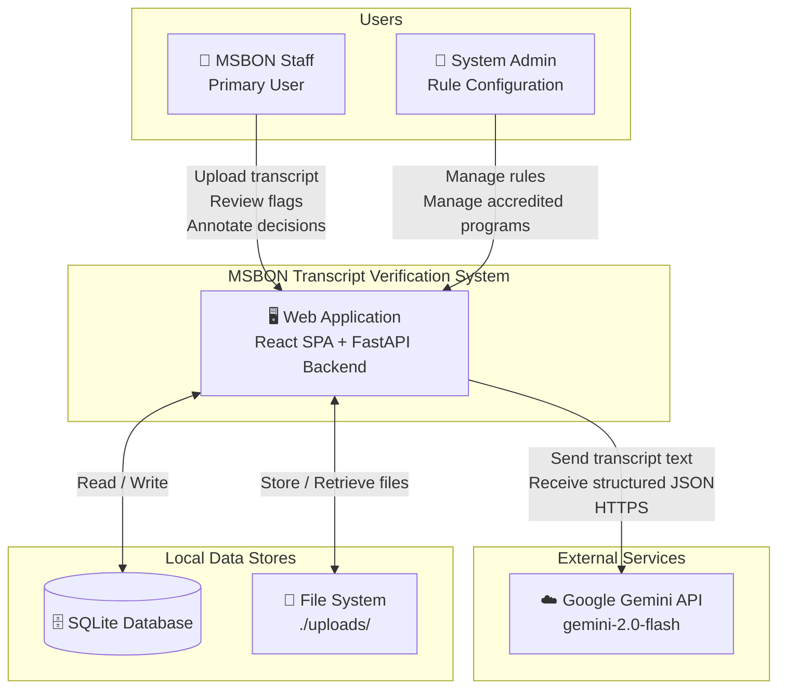
```mermaid
graph TB
    subgraph users["Users"]
        Staff["👤 MSBON Staff\nPrimary User"]
        Admin["👤 System Admin\nRule Configuration"]
    end

    subgraph system["MSBON Transcript Verification System"]
        App["🖥️ Web Application\nReact SPA + FastAPI Backend"]
    end

    subgraph external["External Services"]
        Gemini["☁️ Google Gemini API\ngemini-2.0-flash"]
    end

    subgraph storage["Local Data Stores"]
        DB[("🗄️ SQLite Database")]
        FS["📁 File System\n./uploads/"]
    end

    Staff -->|"Upload transcript\nReview flags\nAnnotate decisions"| App
    Admin -->|"Manage rules\nManage accredited programs"| App
    App -->|"Send transcript text\nReceive structured JSON\nHTTPS"| Gemini
    App <-->|"Read / Write"| DB
    App <-->|"Store / Retrieve files"| FS
```

### 2.5 Assumptions and Constraints

| Constraint | Detail |
|------------|--------|
| Scope | PoC only, not for production deployment or public access |
| Transcript origin | Only domestic (U.S.) transcripts in scope |
| Data | Only synthetic or de-identified sample transcripts during development |
| Storage | No permanent retention of real transcript content |
| Network | Operates on local or private network |
| AI authority | All AI outputs advisory, no automated licensure decisions |
| Runtime | Python 3.11+, Node.js 18+ |

---

## 3. Architectural Design

### 3.1 Architectural Style

The system follows a **Layered Architecture** pattern with strict separation of concerns across five layers.

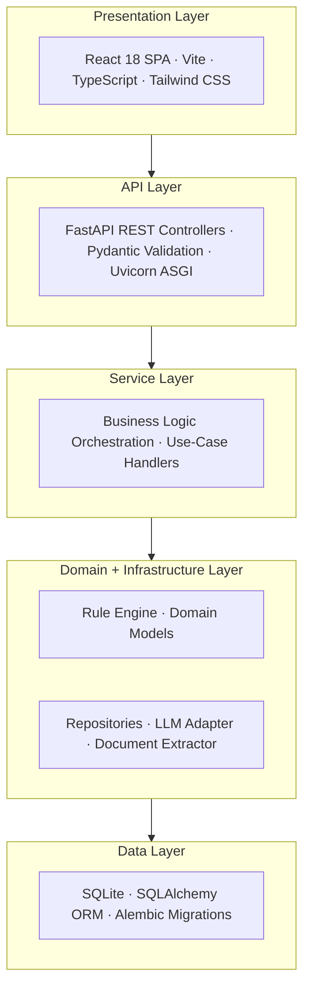
```mermaid
graph TB
    subgraph L1["Presentation Layer"]
        UI["React 18 SPA · Vite · TypeScript · Tailwind CSS"]
    end
    subgraph L2["API Layer"]
        API["FastAPI REST Controllers · Pydantic Validation · Uvicorn ASGI"]
    end
    subgraph L3["Service Layer"]
        SVC["Business Logic Orchestration · Use-Case Handlers"]
    end
    subgraph L4["Domain + Infrastructure Layer"]
        DOM["Rule Engine · Domain Models"]
        INF["Repositories · LLM Adapter · Document Extractor"]
    end
    subgraph L5["Data Layer"]
        DATA["SQLite · SQLAlchemy ORM · Alembic Migrations"]
    end

    L1 --> L2 --> L3 --> L4 --> L5
```

**Why layered architecture:**

| Benefit | How it applies |
|---------|---------------|
| Testability | Each layer tested independently with mocks at boundaries |
| Auditability | All business logic isolated, every flag traceable to a rule class |
| Maintainability | Rule engine evolves without touching API or UI |
| Explainability | Transparent rule logic required by scope; no black-box processing |

### 3.2 Container Diagram (C4 Level 2)

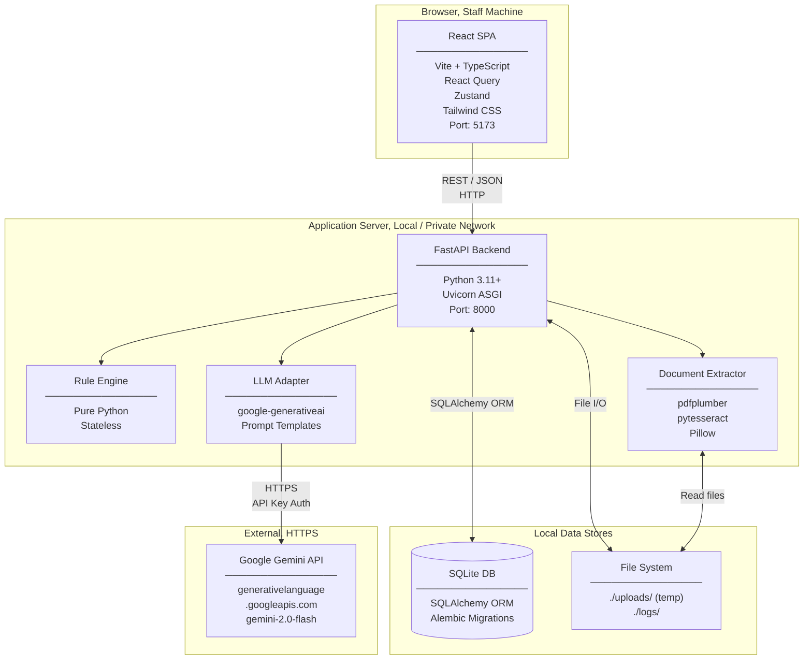
```mermaid
graph TB
    subgraph browser["Browser, Staff Machine"]
        SPA["React SPA\n────────────────\nVite + TypeScript\nReact Query\nZustand\nTailwind CSS\nPort: 5173"]
    end

    subgraph server["Application Server, Local / Private Network"]
        direction TB
        FAPI["FastAPI Backend\n────────────────\nPython 3.11+\nUvicorn ASGI\nPort: 8000"]
        RE["Rule Engine\n────────────────\nPure Python\nStateless"]
        DE["Document Extractor\n────────────────\npdfplumber\npytesseract\nPillow"]
        LLM["LLM Adapter\n────────────────\ngoogle-generativeai\nPrompt Templates"]
    end

    subgraph datastores["Local Data Stores"]
        DB[("SQLite DB\n────────────────\nSQLAlchemy ORM\nAlembic Migrations")]
        FS["File System\n────────────────\n./uploads/ (temp)\n./logs/"]
    end

    subgraph gemini["External, HTTPS"]
        GAPI["Google Gemini API\n────────────────\ngenerativelanguage\n.googleapis.com\ngemini-2.0-flash"]
    end

    SPA -->|"REST / JSON\nHTTP"| FAPI
    FAPI --> RE
    FAPI --> DE
    FAPI --> LLM
    LLM -->|"HTTPS\nAPI Key Auth"| GAPI
    FAPI <-->|"SQLAlchemy ORM"| DB
    FAPI <-->|"File I/O"| FS
    DE <-->|"Read files"| FS
```

### 3.3 Backend Component Diagram (C4 Level 3)

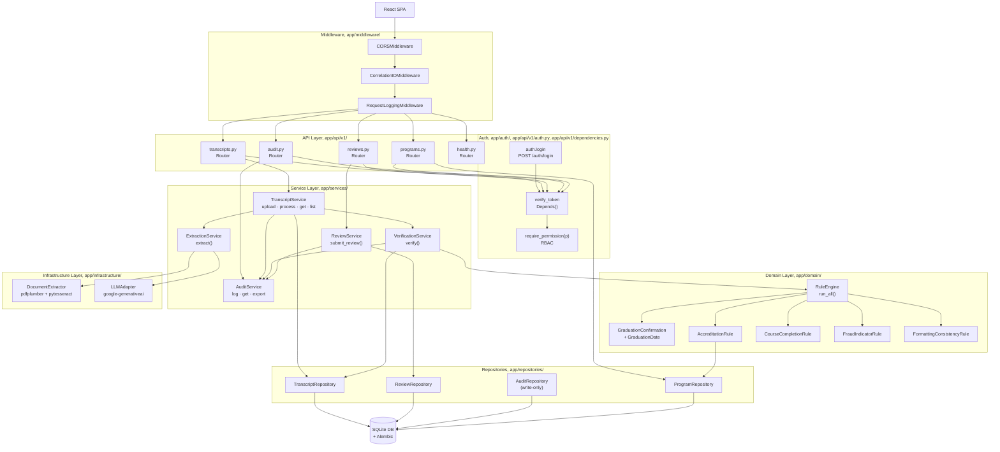
```mermaid
graph TB
    subgraph mw["Middleware, app/middleware/"]
        CID["CorrelationIDMiddleware"]
        REQ["RequestLoggingMiddleware"]
        CORS["CORSMiddleware"]
    end

    subgraph auth["Auth, app/auth/, app/api/v1/auth.py, app/api/v1/dependencies.py"]
        LOGIN["auth.login\nPOST /auth/login"]
        VTOK["verify_token\nDepends()"]
        RPERM["require_permission(p)\nRBAC"]
    end

    subgraph api["API Layer, app/api/v1/"]
        TR["transcripts.py\nRouter"]
        RV["reviews.py\nRouter"]
        AL["audit.py\nRouter"]
        PG["programs.py\nRouter"]
        HE["health.py\nRouter"]
    end

    subgraph svc["Service Layer, app/services/"]
        TS["TranscriptService\nupload · process · get · list"]
        ES["ExtractionService\nextract()"]
        VS["VerificationService\nverify()"]
        RS["ReviewService\nsubmit_review()"]
        AS["AuditService\nlog · get · export"]
    end

    subgraph dom["Domain Layer, app/domain/"]
        REN["RuleEngine\nrun_all()"]
        GR["GraduationConfirmation\n+ GraduationDate"]
        AR["AccreditationRule"]
        CR["CourseCompletionRule"]
        FR["FraudIndicatorRule"]
        FMR["FormattingConsistencyRule"]
    end

    subgraph infra["Infrastructure Layer, app/infrastructure/"]
        DOCEX["DocumentExtractor\npdfplumber + pytesseract"]
        LLMAD["LLMAdapter\ngoogle-generativeai"]
    end

    subgraph repo["Repositories, app/repositories/"]
        TREP["TranscriptRepository"]
        RREP["ReviewRepository"]
        AREP["AuditRepository<br/>(write-only)"]
        PREP["ProgramRepository"]
    end

    Client["React SPA"] --> CORS --> CID --> REQ
    REQ --> TR & RV & AL & PG & HE
    LOGIN --> VTOK
    TR & RV & AL & PG --> VTOK --> RPERM

    TR --> TS
    RV --> RS
    AL --> AS
    PG --> PREP

    TS --> ES
    TS --> VS
    TS --> AS
    TS --> TREP

    ES --> DOCEX
    ES --> LLMAD

    VS --> REN
    VS --> AS
    VS --> TREP

    RS --> RREP
    RS --> AS

    REN --> GR & AR & CR & FR & FMR
    AR --> PREP

    TREP & RREP & AREP & PREP --> DB[("SQLite DB\n+ Alembic")]
```

### 3.4 Frontend Component Hierarchy

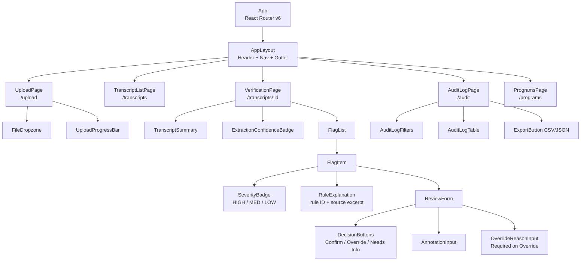
```mermaid
graph TB
    APP["App\nReact Router v6"]

    APP --> LAYOUT["AppLayout\nHeader + Nav + Outlet"]

    LAYOUT --> UP["UploadPage\n/upload"]
    LAYOUT --> TLP["TranscriptListPage\n/transcripts"]
    LAYOUT --> VP["VerificationPage\n/transcripts/:id"]
    LAYOUT --> ALP["AuditLogPage\n/audit"]
    LAYOUT --> PGP["ProgramsPage\n/programs"]

    UP --> FD["FileDropzone"]
    UP --> PB["UploadProgressBar"]

    VP --> TS2["TranscriptSummary"]
    VP --> ECB["ExtractionConfidenceBadge"]
    VP --> FL["FlagList"]

    FL --> FI["FlagItem"]
    FI --> SB["SeverityBadge\nHIGH / MED / LOW"]
    FI --> RE2["RuleExplanation\nrule ID + source excerpt"]
    FI --> RF["ReviewForm"]

    RF --> DB2["DecisionButtons\nConfirm / Override / Needs Info"]
    RF --> AI["AnnotationInput"]
    RF --> ORI["OverrideReasonInput\nRequired on Override"]

    ALP --> ALF["AuditLogFilters"]
    ALP --> ALT["AuditLogTable"]
    ALP --> EB["ExportButton CSV/JSON"]
```

### 3.5 Deployment Diagram (PoC)

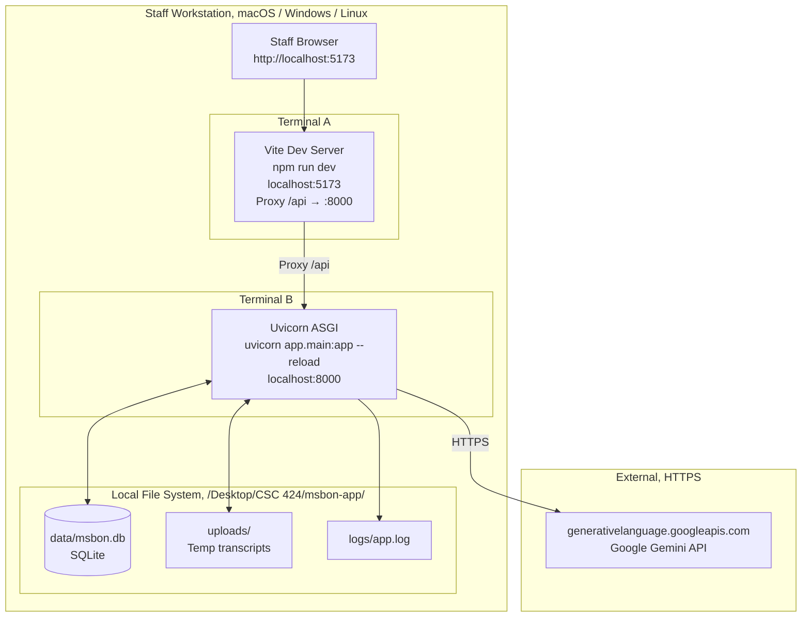
```mermaid
graph TB
    subgraph workstation["Staff Workstation, macOS / Windows / Linux"]
        subgraph termA["Terminal A"]
            VITE["Vite Dev Server\nnpm run dev\nlocalhost:5173\nProxy /api → :8000"]
        end
        subgraph termB["Terminal B"]
            UVCN["Uvicorn ASGI\nuvicorn app.main:app --reload\nlocalhost:8000"]
        end
        subgraph fs["Local File System, /Desktop/CSC 424/msbon-app/"]
            DB3[("data/msbon.db\nSQLite")]
            UPL["uploads/\nTemp transcripts"]
            LOG["logs/app.log"]
        end
        BROWSER["Staff Browser\nhttp://localhost:5173"]
    end

    subgraph ext["External, HTTPS"]
        GAPI2["generativelanguage.googleapis.com\nGoogle Gemini API"]
    end

    BROWSER --> VITE
    VITE -->|"Proxy /api"| UVCN
    UVCN <--> DB3
    UVCN <--> UPL
    UVCN --> LOG
    UVCN -->|"HTTPS"| GAPI2
```

---

## 4. Data Design

### 4.1 Entity-Relationship Diagram

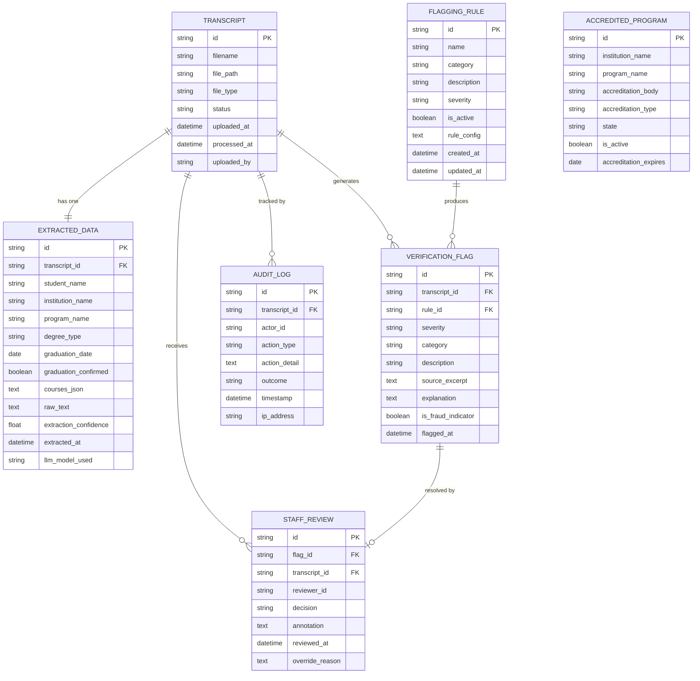
```mermaid
erDiagram
    TRANSCRIPT {
        string id PK
        string filename
        string file_path
        string file_type
        string status
        datetime uploaded_at
        datetime processed_at
        string uploaded_by
    }

    EXTRACTED_DATA {
        string id PK
        string transcript_id FK
        string student_name
        string institution_name
        string program_name
        string degree_type
        date graduation_date
        boolean graduation_confirmed
        text courses_json
        text raw_text
        float extraction_confidence
        datetime extracted_at
        string llm_model_used
    }

    VERIFICATION_FLAG {
        string id PK
        string transcript_id FK
        string rule_id FK
        string severity
        string category
        string description
        text source_excerpt
        text explanation
        boolean is_fraud_indicator
        datetime flagged_at
    }

    STAFF_REVIEW {
        string id PK
        string flag_id FK
        string transcript_id FK
        string reviewer_id
        string decision
        text annotation
        datetime reviewed_at
        text override_reason
    }

    AUDIT_LOG {
        string id PK
        string transcript_id FK
        string actor_id
        string action_type
        text action_detail
        string outcome
        datetime timestamp
        string ip_address
    }

    FLAGGING_RULE {
        string id PK
        string name
        string category
        string description
        string severity
        boolean is_active
        text rule_config
        datetime created_at
        datetime updated_at
    }

    ACCREDITED_PROGRAM {
        string id PK
        string institution_name
        string program_name
        string accreditation_body
        string accreditation_type
        string state
        boolean is_active
        date accreditation_expires
    }

    TRANSCRIPT ||--|| EXTRACTED_DATA : "has one"
    TRANSCRIPT ||--o{ VERIFICATION_FLAG : "generates"
    TRANSCRIPT ||--o{ STAFF_REVIEW : "receives"
    TRANSCRIPT ||--o{ AUDIT_LOG : "tracked by"
    VERIFICATION_FLAG ||--o| STAFF_REVIEW : "resolved by"
    FLAGGING_RULE ||--o{ VERIFICATION_FLAG : "produces"
```

### 4.2 Database Schema

#### Table: `transcripts`

| Column | Type | Constraints | Description |
|--------|------|-------------|-------------|
| id | VARCHAR(36) | PK, NOT NULL | UUID v4 |
| filename | VARCHAR(255) | NOT NULL | Original filename (sanitized for display only) |
| file_path | VARCHAR(512) | NOT NULL | Relative path under `./uploads/` |
| file_type | VARCHAR(10) | NOT NULL, CHECK IN ('pdf','image') | File category |
| status | VARCHAR(20) | NOT NULL | See §4.3 state machine |
| uploaded_at | DATETIME | NOT NULL | UTC timestamp |
| processed_at | DATETIME | NULLABLE | UTC, set when verification completes |
| uploaded_by | VARCHAR(100) | NOT NULL | Staff identifier from `X-Staff-ID` header |

#### Table: `extracted_data`

| Column | Type | Constraints | Description |
|--------|------|-------------|-------------|
| id | VARCHAR(36) | PK | UUID v4 |
| transcript_id | VARCHAR(36) | FK → transcripts.id, UNIQUE | One-to-one with transcript |
| student_name | VARCHAR(255) | NULLABLE | Full name as extracted |
| institution_name | VARCHAR(255) | NULLABLE | School name as extracted |
| program_name | VARCHAR(255) | NULLABLE | Nursing program name |
| degree_type | VARCHAR(20) | NULLABLE | ADN / BSN / MSN / DNP / LPN / OTHER |
| graduation_date | DATE | NULLABLE | ISO 8601 |
| graduation_confirmed | BOOLEAN | NOT NULL DEFAULT FALSE | True only when explicit conferral statement present |
| courses_json | TEXT | NULLABLE | JSON array of course objects |
| raw_text | TEXT | NULLABLE | Full text from OCR / PDF extraction |
| extraction_confidence | REAL | NULLABLE | 0.0–1.0 model confidence |
| extracted_at | DATETIME | NOT NULL | UTC |
| llm_model_used | VARCHAR(100) | NOT NULL | e.g., `gemini-2.0-flash` |

#### Table: `verification_flags`

| Column | Type | Constraints | Description |
|--------|------|-------------|-------------|
| id | VARCHAR(36) | PK | UUID v4 |
| transcript_id | VARCHAR(36) | FK → transcripts.id | |
| rule_id | VARCHAR(36) | FK → flagging_rules.id | Rule that produced this flag |
| severity | VARCHAR(10) | NOT NULL | HIGH / MEDIUM / LOW |
| category | VARCHAR(20) | NOT NULL | GRADUATION / ACCREDITATION / COURSE / FRAUD / FORMAT |
| description | VARCHAR(500) | NOT NULL | One-line human-readable description |
| source_excerpt | TEXT | NULLABLE | Verbatim text from transcript that triggered flag |
| explanation | TEXT | NOT NULL | Full rule rationale with rule ID |
| is_fraud_indicator | BOOLEAN | NOT NULL | |
| flagged_at | DATETIME | NOT NULL | UTC |

#### Table: `staff_reviews`

| Column | Type | Constraints | Description |
|--------|------|-------------|-------------|
| id | VARCHAR(36) | PK | UUID v4 |
| flag_id | VARCHAR(36) | FK → verification_flags.id, UNIQUE | One review per flag |
| transcript_id | VARCHAR(36) | FK → transcripts.id | Denormalized for query convenience |
| reviewer_id | VARCHAR(100) | NOT NULL | Staff identifier |
| decision | VARCHAR(20) | NOT NULL | CONFIRMED / OVERRIDDEN / NEEDS_MORE_INFO |
| annotation | TEXT | NULLABLE | Staff notes |
| reviewed_at | DATETIME | NOT NULL | UTC |
| override_reason | TEXT | NULLABLE | **Required** when `decision = OVERRIDDEN` |

#### Table: `audit_logs`

| Column | Type | Constraints | Description |
|--------|------|-------------|-------------|
| id | VARCHAR(36) | PK | UUID v4 |
| transcript_id | VARCHAR(36) | FK NULLABLE | Null for system-level events |
| actor_id | VARCHAR(100) | NOT NULL | Staff or system identifier |
| action_type | VARCHAR(50) | NOT NULL | UPLOAD / EXTRACT / VERIFY / REVIEW_FLAG / OVERRIDE_FLAG / EXPORT / VIEW |
| action_detail | TEXT | NOT NULL | JSON blob with full context |
| outcome | VARCHAR(20) | NOT NULL | SUCCESS / FAILURE / PARTIAL |
| timestamp | DATETIME | NOT NULL | UTC |
| ip_address | VARCHAR(45) | NULLABLE | IPv4 or IPv6 |

> **Immutability constraint:** No UPDATE or DELETE operations are permitted on `audit_logs`. Enforced at the `AuditRepository` layer, `save()` is the only allowed write operation.

#### Table: `flagging_rules`

| Column | Type | Constraints | Description |
|--------|------|-------------|-------------|
| id | VARCHAR(36) | PK | UUID v4 |
| name | VARCHAR(100) | NOT NULL, UNIQUE | Rule short name (e.g., `GRAD-001`) |
| category | VARCHAR(20) | NOT NULL | GRADUATION / ACCREDITATION / COURSE / FRAUD / FORMAT |
| description | TEXT | NOT NULL | Full description of what this rule checks |
| severity | VARCHAR(10) | NOT NULL | HIGH / MEDIUM / LOW |
| is_active | BOOLEAN | NOT NULL DEFAULT TRUE | Disabled rules are skipped by RuleEngine |
| rule_config | TEXT | NULLABLE | JSON for configurable thresholds (e.g., min program months) |
| created_at | DATETIME | NOT NULL | UTC |
| updated_at | DATETIME | NOT NULL | UTC |

#### Table: `accredited_programs`

| Column | Type | Constraints | Description |
|--------|------|-------------|-------------|
| id | VARCHAR(36) | PK | UUID v4 |
| institution_name | VARCHAR(255) | NOT NULL | Full institution name |
| program_name | VARCHAR(255) | NOT NULL | Nursing program name |
| accreditation_body | VARCHAR(20) | NOT NULL | ACEN / CCNE / STATE / OTHER |
| accreditation_type | VARCHAR(50) | NOT NULL | |
| state | VARCHAR(2) | NOT NULL | Two-letter state code |
| is_active | BOOLEAN | NOT NULL DEFAULT TRUE | |
| accreditation_expires | DATE | NULLABLE | |

### 4.3 Transcript State Machine

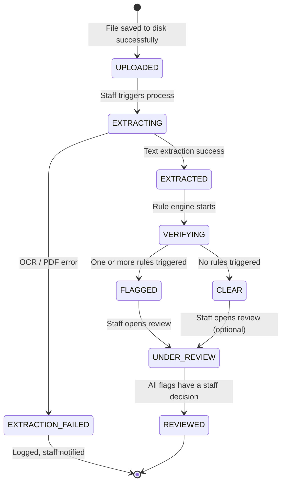
```mermaid
stateDiagram-v2
    [*] --> UPLOADED : File saved to disk successfully

    UPLOADED --> EXTRACTING : Staff triggers process

    EXTRACTING --> EXTRACTED : Text extraction success
    EXTRACTING --> EXTRACTION_FAILED : OCR / PDF error

    EXTRACTION_FAILED --> [*] : Logged, staff notified

    EXTRACTED --> VERIFYING : Rule engine starts

    VERIFYING --> FLAGGED : One or more rules triggered
    VERIFYING --> CLEAR : No rules triggered

    FLAGGED --> UNDER_REVIEW : Staff opens review
    CLEAR --> UNDER_REVIEW : Staff opens review (optional)

    UNDER_REVIEW --> REVIEWED : All flags have a staff decision

    REVIEWED --> [*]
```

### 4.4 Data Flow Diagram

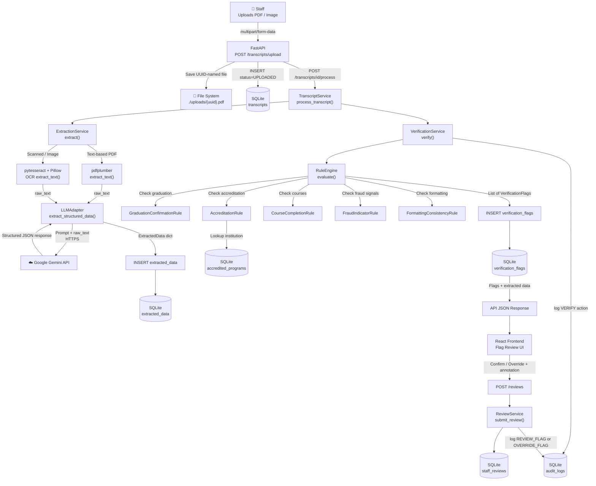
```mermaid
flowchart TD
    A["👤 Staff\nUploads PDF / Image"] -->|"multipart/form-data"| B["FastAPI\nPOST /transcripts/upload"]
    B -->|"Save UUID-named file"| C["📁 File System\n./uploads/{uuid}.pdf"]
    B -->|"INSERT status=UPLOADED"| D[("SQLite\ntranscripts")]

    B -->|"POST /transcripts/id/process"| E["TranscriptService\nprocess_transcript()"]
    E --> F["ExtractionService\nextract()"]
    F -->|"Text-based PDF"| G["pdfplumber\nextract_text()"]
    F -->|"Scanned / Image"| H["pytesseract + Pillow\nOCR extract_text()"]
    G & H -->|"raw_text"| I["LLMAdapter\nextract_structured_data()"]
    I -->|"Prompt + raw_text\nHTTPS"| J["☁️ Google Gemini API"]
    J -->|"Structured JSON response"| I
    I -->|"ExtractedData dict"| K["INSERT extracted_data"]
    K --> D2[("SQLite\nextracted_data")]

    E --> L["VerificationService\nverify()"]
    L --> M["RuleEngine\nevaluate()"]
    M -->|"Check graduation"| N["GraduationConfirmationRule"]
    M -->|"Check accreditation"| O["AccreditationRule"]
    M -->|"Check courses"| P["CourseCompletionRule"]
    M -->|"Check fraud signals"| Q["FraudIndicatorRule"]
    M -->|"Check formatting"| R["FormattingConsistencyRule"]
    O -->|"Lookup institution"| S[("SQLite\naccredited_programs")]

    M -->|"List of VerificationFlags"| T["INSERT verification_flags"]
    T --> D3[("SQLite\nverification_flags")]
    L -->|"log VERIFY action"| U[("SQLite\naudit_logs")]

    D3 -->|"Flags + extracted data"| V["API JSON Response"]
    V --> W["React Frontend\nFlag Review UI"]

    W -->|"Confirm / Override + annotation"| X["POST /reviews"]
    X --> Y["ReviewService\nsubmit_review()"]
    Y --> Z[("SQLite\nstaff_reviews")]
    Y -->|"log REVIEW_FLAG or OVERRIDE_FLAG"| U
```

---

## 5. Component Design

### 5.1 Class Diagram, Domain Models

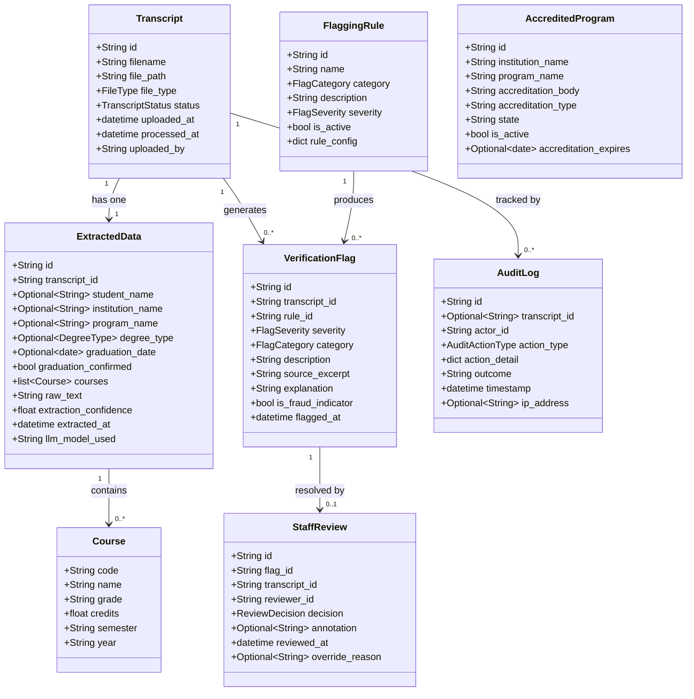
```mermaid
classDiagram
    class Transcript {
        +String id
        +String filename
        +String file_path
        +FileType file_type
        +TranscriptStatus status
        +datetime uploaded_at
        +datetime processed_at
        +String uploaded_by
    }

    class ExtractedData {
        +String id
        +String transcript_id
        +Optional~String~ student_name
        +Optional~String~ institution_name
        +Optional~String~ program_name
        +Optional~DegreeType~ degree_type
        +Optional~date~ graduation_date
        +bool graduation_confirmed
        +list~Course~ courses
        +String raw_text
        +float extraction_confidence
        +datetime extracted_at
        +String llm_model_used
    }

    class Course {
        +String code
        +String name
        +String grade
        +float credits
        +String semester
        +String year
    }

    class VerificationFlag {
        +String id
        +String transcript_id
        +String rule_id
        +FlagSeverity severity
        +FlagCategory category
        +String description
        +String source_excerpt
        +String explanation
        +bool is_fraud_indicator
        +datetime flagged_at
    }

    class StaffReview {
        +String id
        +String flag_id
        +String transcript_id
        +String reviewer_id
        +ReviewDecision decision
        +Optional~String~ annotation
        +datetime reviewed_at
        +Optional~String~ override_reason
    }

    class AuditLog {
        +String id
        +Optional~String~ transcript_id
        +String actor_id
        +AuditActionType action_type
        +dict action_detail
        +String outcome
        +datetime timestamp
        +Optional~String~ ip_address
    }

    class FlaggingRule {
        +String id
        +String name
        +FlagCategory category
        +String description
        +FlagSeverity severity
        +bool is_active
        +dict rule_config
    }

    class AccreditedProgram {
        +String id
        +String institution_name
        +String program_name
        +String accreditation_body
        +String accreditation_type
        +String state
        +bool is_active
        +Optional~date~ accreditation_expires
    }

    Transcript "1" --> "1" ExtractedData : has one
    Transcript "1" --> "0..*" VerificationFlag : generates
    Transcript "1" --> "0..*" AuditLog : tracked by
    ExtractedData "1" --> "0..*" Course : contains
    VerificationFlag "1" --> "0..1" StaffReview : resolved by
    FlaggingRule "1" --> "0..*" VerificationFlag : produces
```

### 5.2 Class Diagram, Service Layer

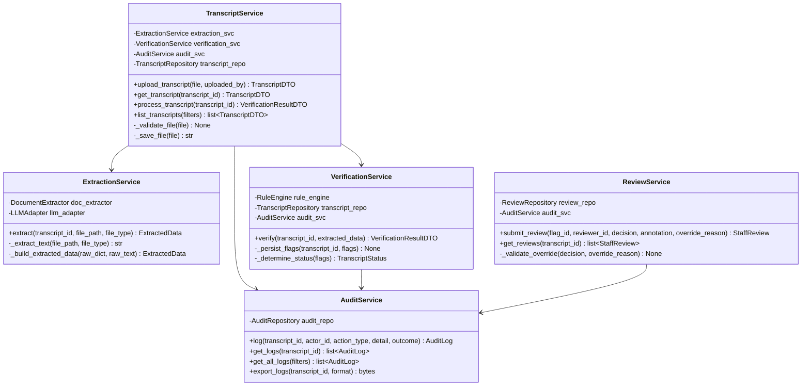
```mermaid
classDiagram
    class TranscriptService {
        -ExtractionService extraction_svc
        -VerificationService verification_svc
        -AuditService audit_svc
        -TranscriptRepository transcript_repo
        +upload_transcript(file, uploaded_by) TranscriptDTO
        +get_transcript(transcript_id) TranscriptDTO
        +process_transcript(transcript_id) VerificationResultDTO
        +list_transcripts(filters) list~TranscriptDTO~
        -_validate_file(file) None
        -_save_file(file) str
    }

    class ExtractionService {
        -DocumentExtractor doc_extractor
        -LLMAdapter llm_adapter
        +extract(transcript_id, file_path, file_type) ExtractedData
        -_extract_text(file_path, file_type) str
        -_build_extracted_data(raw_dict, raw_text) ExtractedData
    }

    class VerificationService {
        -RuleEngine rule_engine
        -TranscriptRepository transcript_repo
        -AuditService audit_svc
        +verify(transcript_id, extracted_data) VerificationResultDTO
        -_persist_flags(transcript_id, flags) None
        -_determine_status(flags) TranscriptStatus
    }

    class ReviewService {
        -ReviewRepository review_repo
        -AuditService audit_svc
        +submit_review(flag_id, reviewer_id, decision, annotation, override_reason) StaffReview
        +get_reviews(transcript_id) list~StaffReview~
        -_validate_override(decision, override_reason) None
    }

    class AuditService {
        -AuditRepository audit_repo
        +log(transcript_id, actor_id, action_type, detail, outcome) AuditLog
        +get_logs(transcript_id) list~AuditLog~
        +get_all_logs(filters) list~AuditLog~
        +export_logs(transcript_id, format) bytes
    }

    TranscriptService --> ExtractionService
    TranscriptService --> VerificationService
    TranscriptService --> AuditService
    VerificationService --> AuditService
    ReviewService --> AuditService
```

### 5.3 Class Diagram, Rule Engine

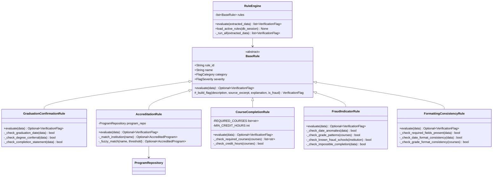
```mermaid
classDiagram
    class RuleEngine {
        -list~BaseRule~ rules
        +evaluate(extracted_data) list~VerificationFlag~
        +load_active_rules(db_session) None
        -_run_all(extracted_data) list~VerificationFlag~
    }

    class BaseRule {
        <<abstract>>
        +String rule_id
        +String name
        +FlagCategory category
        +FlagSeverity severity
        +evaluate(data)* Optional~VerificationFlag~
        #_build_flag(description, source_excerpt, explanation, is_fraud) VerificationFlag
    }

    class GraduationConfirmationRule {
        +evaluate(data) Optional~VerificationFlag~
        -_check_graduation_date(data) bool
        -_check_degree_conferral(data) bool
        -_check_completion_statement(data) bool
    }

    class AccreditationRule {
        -ProgramRepository program_repo
        +evaluate(data) Optional~VerificationFlag~
        -_match_institution(name) Optional~AccreditedProgram~
        -_fuzzy_match(name, threshold) Optional~AccreditedProgram~
    }

    class CourseCompletionRule {
        -REQUIRED_COURSES list~str~
        -MIN_CREDIT_HOURS int
        +evaluate(data) Optional~VerificationFlag~
        -_check_required_courses(courses) list~str~
        -_check_credit_hours(courses) bool
    }

    class FraudIndicatorRule {
        +evaluate(data) Optional~VerificationFlag~
        -_check_date_anomalies(data) bool
        -_check_grade_patterns(courses) bool
        -_check_known_fraud_schools(institution) bool
        -_check_impossible_completion(data) bool
    }

    class FormattingConsistencyRule {
        +evaluate(data) Optional~VerificationFlag~
        -_check_required_fields_present(data) bool
        -_check_date_format_consistency(data) bool
        -_check_grade_format_consistency(courses) bool
    }

    RuleEngine --> BaseRule
    BaseRule <|-- GraduationConfirmationRule
    BaseRule <|-- AccreditationRule
    BaseRule <|-- CourseCompletionRule
    BaseRule <|-- FraudIndicatorRule
    BaseRule <|-- FormattingConsistencyRule
    AccreditationRule --> ProgramRepository
```

### 5.4 Flagging Rules Reference

| Rule ID | Name | Category | Severity | Description |
|---------|------|----------|----------|-------------|
| GRAD-001 | Missing graduation confirmation | GRADUATION | HIGH | No explicit degree conferral statement found |
| GRAD-002 | Graduation date absent | GRADUATION | MEDIUM | Graduation date field not present |
| ACCR-001 | Institution not in MS accredited list | ACCREDITATION | HIGH | School not found in accredited_programs table |
| ACCR-002 | Accreditation body not recognized | ACCREDITATION | MEDIUM | Body is not ACEN or CCNE |
| COUR-001 | Required nursing courses not present | COURSE | HIGH | One or more mandatory courses missing from course list |
| COUR-002 | Insufficient credit hours | COURSE | MEDIUM | Total nursing credits below minimum threshold |
| FRAU-001 | Program completion time below minimum | FRAUD | HIGH | Duration from enrollment to graduation is physically impossible |
| FRAU-002 | Suspicious grade distribution | FRAUD | MEDIUM | Abnormal pattern suggesting grade fabrication |
| FRAU-003 | Institution on fraud watch list | FRAUD | HIGH | School name matches known fraudulent program |
| FORM-001 | Required transcript fields missing | FORMAT | LOW | Key fields (name, school, program) could not be extracted |
| FORM-002 | Inconsistent date formatting | FORMAT | LOW | Dates appear in multiple conflicting formats |
| FORM-003 | Inconsistent grade formatting | FORMAT | LOW | Grade notation changes mid-transcript |

### 5.5 Class Diagram, Infrastructure Layer

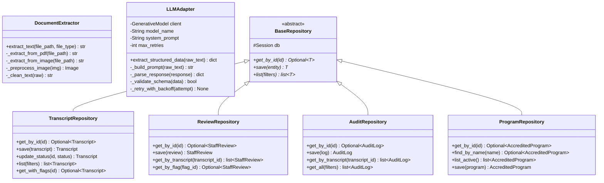
```mermaid
classDiagram
    class DocumentExtractor {
        +extract_text(file_path, file_type) str
        -_extract_from_pdf(file_path) str
        -_extract_from_image(file_path) str
        -_preprocess_image(img) Image
        -_clean_text(raw) str
    }

    class LLMAdapter {
        -GenerativeModel client
        -String model_name
        -String system_prompt
        -int max_retries
        +extract_structured_data(raw_text) dict
        -_build_prompt(raw_text) str
        -_parse_response(response) dict
        -_validate_schema(data) bool
        -_retry_with_backoff(attempt) None
    }

    class BaseRepository {
        <<abstract>>
        #Session db
        +get_by_id(id)* Optional~T~
        +save(entity)* T
        +list(filters)* list~T~
    }

    class TranscriptRepository {
        +get_by_id(id) Optional~Transcript~
        +save(transcript) Transcript
        +update_status(id, status) Transcript
        +list(filters) list~Transcript~
        +get_with_flags(id) Optional~Transcript~
    }

    class ReviewRepository {
        +get_by_id(id) Optional~StaffReview~
        +save(review) StaffReview
        +get_by_transcript(transcript_id) list~StaffReview~
        +get_by_flag(flag_id) Optional~StaffReview~
    }

    class AuditRepository {
        +get_by_id(id) Optional~AuditLog~
        +save(log) AuditLog
        +get_by_transcript(transcript_id) list~AuditLog~
        +get_all(filters) list~AuditLog~
    }

    class ProgramRepository {
        +get_by_id(id) Optional~AccreditedProgram~
        +find_by_name(name) Optional~AccreditedProgram~
        +list_active() list~AccreditedProgram~
        +save(program) AccreditedProgram
    }

    BaseRepository <|-- TranscriptRepository
    BaseRepository <|-- ReviewRepository
    BaseRepository <|-- AuditRepository
    BaseRepository <|-- ProgramRepository
```

> **AuditRepository immutability note:** The `AuditRepository` deliberately omits `update()` and `delete()` methods. Any attempt to modify audit log records raises `OperationNotPermittedError` at the repository boundary.

---

## 6. Interface Design

### 6.1 REST API Overview

**Base URL:** `http://localhost:8000/api/v1`

| Method | Endpoint | Description |
|--------|----------|-------------|
| POST | `/transcripts/upload` | Upload a transcript file |
| POST | `/transcripts/{id}/process` | Trigger extraction + verification |
| GET | `/transcripts/{id}` | Get transcript with extracted data + flags |
| GET | `/transcripts` | List all transcripts (paginated, filterable) |
| POST | `/reviews` | Submit a staff review decision |
| GET | `/reviews/{transcript_id}` | Get all reviews for a transcript |
| GET | `/audit-logs` | Get all audit logs (filterable) |
| GET | `/audit-logs/{transcript_id}` | Get audit trail for one transcript |
| GET | `/audit-logs/{transcript_id}/export` | Export audit trail (CSV or JSON) |
| GET | `/programs` | List accredited nursing programs |
| POST | `/programs` | Add an accredited program (admin) |
| GET | `/health` | System health check |

**Standard Request Headers:**

| Header | Required On | Value |
|--------|-------------|-------|
| `X-Staff-ID` | All write operations | Staff identifier string |
| `X-Staff-Role` | Admin-only endpoints | `admin` |
| `Content-Type` | JSON body requests | `application/json` |

**Standard Error Response Shape:**
```json
{
  "error": {
    "code": "ERROR_CODE",
    "message": "Human-readable message",
    "detail": "Optional technical detail",
    "transcript_id": "optional-uuid",
    "timestamp": "2026-03-28T14:00:00Z"
  }
}
```

### 6.2 Endpoint Contracts

#### `POST /transcripts/upload`

Upload a transcript file for processing.

**Request:** `multipart/form-data`

| Field | Type | Required | Description |
|-------|------|----------|-------------|
| file | binary | Yes | PDF, PNG, JPEG, or TIFF, max 10MB |
| uploaded_by | string | Yes | Staff identifier |

**Response `201 Created`:**
```json
{
  "id": "3fa85f64-5717-4562-b3fc-2c963f66afa6",
  "filename": "transcript_jane_doe.pdf",
  "status": "UPLOADED",
  "uploaded_at": "2026-03-28T14:00:00Z",
  "uploaded_by": "staff_dr_burks"
}
```

**Error responses:**

| Status | Code | Condition |
|--------|------|-----------|
| 400 | `INVALID_FILE_TYPE` | File is not PDF / PNG / JPEG / TIFF |
| 413 | `FILE_TOO_LARGE` | File exceeds 10MB |

---

#### `POST /transcripts/{id}/process`

Trigger the extraction and verification pipeline.

**Response `202 Accepted`:**
```json
{
  "transcript_id": "3fa85f64-...",
  "status": "EXTRACTING",
  "message": "Processing pipeline started"
}
```

---

#### `GET /transcripts/{id}`

Retrieve a transcript with extracted data and all flags.

**Response `200 OK`:**
```json
{
  "id": "3fa85f64-...",
  "filename": "transcript_jane_doe.pdf",
  "status": "FLAGGED",
  "uploaded_at": "2026-03-28T14:00:00Z",
  "processed_at": "2026-03-28T14:01:32Z",
  "extracted_data": {
    "student_name": "Jane Doe",
    "institution_name": "University of Southern Mississippi",
    "program_name": "Bachelor of Science in Nursing",
    "degree_type": "BSN",
    "graduation_date": "2024-05-15",
    "graduation_confirmed": true,
    "courses": [
      {
        "code": "NUR 301",
        "name": "Fundamentals of Nursing",
        "grade": "A",
        "credits": 3.0,
        "semester": "Fall",
        "year": "2022"
      }
    ],
    "extraction_confidence": 0.94,
    "extracted_at": "2026-03-28T14:01:05Z"
  },
  "flags": [
    {
      "id": "flag-uuid",
      "severity": "HIGH",
      "category": "FRAUD",
      "description": "Program completion time below minimum threshold",
      "source_excerpt": "Enrollment: January 2024 | Graduation: May 2024",
      "explanation": "Rule FRAU-001: BSN program requires minimum 24 months. Detected completion in approximately 4 months.",
      "is_fraud_indicator": true,
      "flagged_at": "2026-03-28T14:01:30Z",
      "review": null
    }
  ]
}
```

---

#### `POST /reviews`

Submit a staff review decision on a specific flag.

**Request body:**
```json
{
  "flag_id": "flag-uuid",
  "transcript_id": "transcript-uuid",
  "reviewer_id": "staff_dr_burks",
  "decision": "OVERRIDDEN",
  "annotation": "Applicant was in an accelerated BSN bridge program.",
  "override_reason": "Accelerated program documentation verified separately."
}
```

**Decision values:**

| Value | Meaning | `override_reason` required? |
|-------|---------|----------------------------|
| `CONFIRMED` | Staff agrees with the flag | No |
| `OVERRIDDEN` | Staff dismisses the flag | **Yes** |
| `NEEDS_MORE_INFO` | Additional documentation required | No |

**Response `201 Created`:**
```json
{
  "id": "review-uuid",
  "flag_id": "flag-uuid",
  "decision": "OVERRIDDEN",
  "annotation": "Applicant was in an accelerated BSN bridge program.",
  "reviewed_at": "2026-03-28T14:30:00Z"
}
```

**Error responses:**

| Status | Code | Condition |
|--------|------|-----------|
| 404 | `TRANSCRIPT_NOT_FOUND` | Transcript ID doesn't exist |
| 409 | `TRANSCRIPT_NOT_PROCESSED` | Transcript not yet verified |
| 409 | `FLAG_ALREADY_REVIEWED` | Flag already has a staff review |
| 422 | `OVERRIDE_REASON_REQUIRED` | Decision is OVERRIDDEN but reason is missing |

---

#### `GET /audit-logs/{transcript_id}/export`

**Query params:**

| Param | Values | Default |
|-------|--------|---------|
| format | `csv` \| `json` | `json` |

**Response:** Binary file download, `Content-Disposition: attachment; filename="audit_{transcript_id}.{format}"`

---

#### `GET /health`

**Response `200 OK`:**
```json
{
  "status": "healthy",
  "database": "connected",
  "llm_api": "reachable",
  "version": "1.0.0-poc",
  "timestamp": "2026-03-28T14:00:00Z"
}
```

### 6.3 Sequence Diagram, Full Transcript Verification Flow

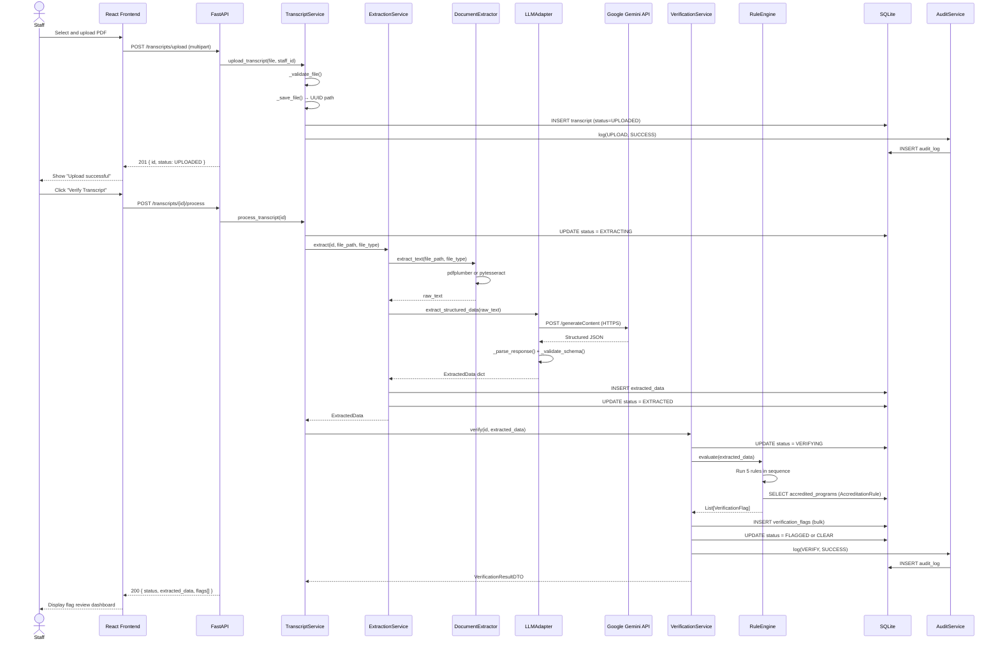
```mermaid
sequenceDiagram
    actor Staff
    participant FE as React Frontend
    participant API as FastAPI
    participant TS as TranscriptService
    participant ES as ExtractionService
    participant DE as DocumentExtractor
    participant LLM as LLMAdapter
    participant Gemini as Google Gemini API
    participant VS as VerificationService
    participant RE as RuleEngine
    participant DB as SQLite
    participant AuditSvc as AuditService

    Staff->>FE: Select and upload PDF
    FE->>API: POST /transcripts/upload (multipart)
    API->>TS: upload_transcript(file, staff_id)
    TS->>TS: _validate_file()
    TS->>TS: _save_file() → UUID path
    TS->>DB: INSERT transcript (status=UPLOADED)
    TS->>AuditSvc: log(UPLOAD, SUCCESS)
    AuditSvc->>DB: INSERT audit_log
    API-->>FE: 201 { id, status: UPLOADED }
    FE-->>Staff: Show "Upload successful"

    Staff->>FE: Click "Verify Transcript"
    FE->>API: POST /transcripts/{id}/process
    API->>TS: process_transcript(id)
    TS->>DB: UPDATE status = EXTRACTING

    TS->>ES: extract(id, file_path, file_type)
    ES->>DE: extract_text(file_path, file_type)
    DE->>DE: pdfplumber or pytesseract
    DE-->>ES: raw_text

    ES->>LLM: extract_structured_data(raw_text)
    LLM->>Gemini: POST /generateContent (HTTPS)
    Gemini-->>LLM: Structured JSON
    LLM->>LLM: _parse_response() + _validate_schema()
    LLM-->>ES: ExtractedData dict

    ES->>DB: INSERT extracted_data
    ES->>DB: UPDATE status = EXTRACTED
    ES-->>TS: ExtractedData

    TS->>VS: verify(id, extracted_data)
    VS->>DB: UPDATE status = VERIFYING
    VS->>RE: evaluate(extracted_data)
    RE->>RE: Run 5 rules in sequence
    RE->>DB: SELECT accredited_programs (AccreditationRule)
    RE-->>VS: List[VerificationFlag]

    VS->>DB: INSERT verification_flags (bulk)
    VS->>DB: UPDATE status = FLAGGED or CLEAR
    VS->>AuditSvc: log(VERIFY, SUCCESS)
    AuditSvc->>DB: INSERT audit_log
    VS-->>TS: VerificationResultDTO

    API-->>FE: 200 { status, extracted_data, flags[] }
    FE-->>Staff: Display flag review dashboard
```

### 6.4 Sequence Diagram, Staff Review Decision

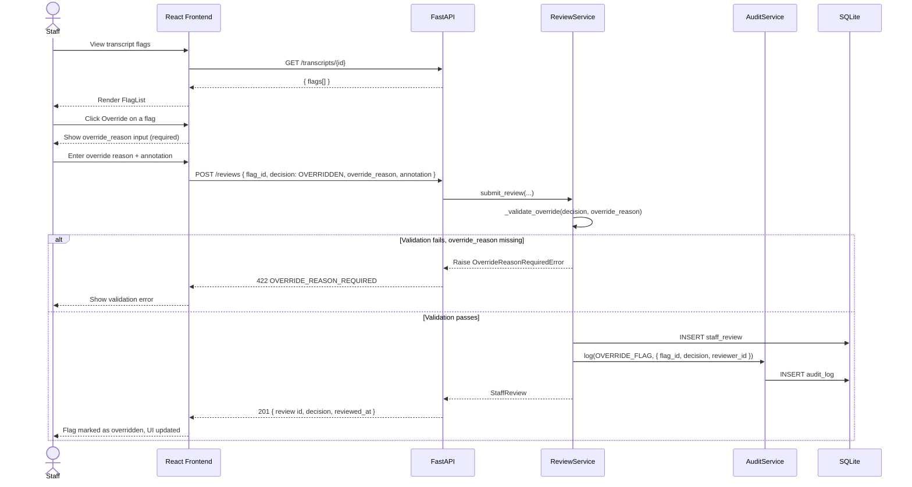
```mermaid
sequenceDiagram
    actor Staff
    participant FE as React Frontend
    participant API as FastAPI
    participant RS as ReviewService
    participant AuditSvc as AuditService
    participant DB as SQLite

    Staff->>FE: View transcript flags
    FE->>API: GET /transcripts/{id}
    API-->>FE: { flags[] }
    FE-->>Staff: Render FlagList

    Staff->>FE: Click Override on a flag
    FE-->>Staff: Show override_reason input (required)
    Staff->>FE: Enter override reason + annotation
    FE->>API: POST /reviews { flag_id, decision: OVERRIDDEN, override_reason, annotation }

    API->>RS: submit_review(...)
    RS->>RS: _validate_override(decision, override_reason)

    alt Validation fails, override_reason missing
        RS-->>API: Raise OverrideReasonRequiredError
        API-->>FE: 422 OVERRIDE_REASON_REQUIRED
        FE-->>Staff: Show validation error
    else Validation passes
        RS->>DB: INSERT staff_review
        RS->>AuditSvc: log(OVERRIDE_FLAG, { flag_id, decision, reviewer_id })
        AuditSvc->>DB: INSERT audit_log
        RS-->>API: StaffReview
        API-->>FE: 201 { review id, decision, reviewed_at }
        FE-->>Staff: Flag marked as overridden, UI updated
    end
```

### 6.5 LLM Prompt Design (Google Gemini)

**System Instruction:**
```
You are a transcript verification assistant for the Mississippi State Board of Nursing (MSBON).
Your only task is to extract structured information from nursing school transcripts.
Do not infer, guess, or fabricate any information.
If a field cannot be determined from the document, return null for that field.
Return ONLY a valid JSON object, no explanation, no markdown, no code fences.
```

**User Prompt Template:**
```
Extract the following information from this nursing school transcript and return it as JSON.

Required output schema:
{
  "student_name":         string | null,
  "institution_name":     string | null,
  "program_name":         string | null,
  "degree_type":          "ADN" | "BSN" | "MSN" | "DNP" | "LPN" | "OTHER" | null,
  "graduation_date":      "YYYY-MM-DD" | null,
  "graduation_confirmed": boolean,
  "enrollment_date":      "YYYY-MM-DD" | null,
  "courses": [
    {
      "code":     string | null,
      "name":     string,
      "grade":    string,
      "credits":  number | null,
      "semester": string | null,
      "year":     string | null
    }
  ],
  "extraction_notes": string | null
}

Rules:
- graduation_confirmed = true ONLY when an explicit degree conferral or graduation statement is present
- Return dates strictly in ISO 8601 format (YYYY-MM-DD)
- Do not populate courses array with non-nursing courses if easily distinguishable

TRANSCRIPT TEXT:
---
{raw_text}
---
```

---

## 7. Security Design

> **Phase A note:** Authentication and authorization in this section reflect the JWT-based implementation that landed in Phase A of the remediation plan (`backend/app/auth/permissions.py`, `backend/app/api/v1/auth.py`, `backend/app/api/v1/dependencies.py`). The earlier `X-Staff-ID` / `X-Staff-Role` header pattern is removed and **must not** be reintroduced.

### 7.1 Threat Model (STRIDE)

| Category | Threat | Risk Level | Mitigation |
|----------|--------|------------|------------|
| **Spoofing** | Impersonating MSBON staff | HIGH | Stateless JWT (HS256) with server-side secret ≥ 32 bytes; client-supplied identity headers ignored |
| **Tampering** | Modifying audit logs after creation | HIGH | `AuditRepository.update()` and `delete()` raise `OperationNotPermittedError`; write-only at repository layer |
| **Repudiation** | Staff denying a review action | HIGH | Every review stores `reviewer_id` (sourced from JWT `sub` claim, not request body), `decision`, `annotation`, `override_reason`, `reviewed_at`, and a correlation ID |
| **Info Disclosure** | Transcript PII leaked via API response | HIGH | File paths never exposed; no PII in log messages; uploads stored outside web root; audit `action_detail` references `transcript_id` only |
| **Info Disclosure** | Transcript content sent externally via LLM | MEDIUM | Only synthetic/de-identified data in PoC; all LLM calls over HTTPS to a single allow-listed host |
| **Info Disclosure** | API key leak via logs / responses | HIGH | `GEMINI_API_KEY` and `JWT_SECRET` read from env only; never logged or returned; redacted in any structured log scrubber |
| **Denial of Service** | Upload request flooding | LOW | 10 MB hard size limit at FastAPI; rate limiting deferred to Phase B |
| **Elevation of Privilege** | Non-admin accessing program / rule management | MEDIUM | `require_permission(Permission.MANAGE_PROGRAMS)` dependency on every admin route; permission set sourced exclusively from JWT role claim |
| **Elevation of Privilege** | Identity impersonation via request body | MEDIUM | `reviewer_id` is **never** read from the request body, always taken from the verified JWT `sub` claim |

### 7.2 File Upload Security Controls

| Control | Implementation |
|---------|---------------|
| MIME type validation | `python-magic` reads file magic bytes, not file extension |
| Cross-validation | Detected MIME must match the claimed extension; mismatch → 422 |
| Filename sanitization | Files saved as `{uuid}.{ext}`, original filename used for display only |
| Path traversal prevention | Upload directory is a fixed absolute path; filenames never concatenated raw |
| Size limit | Enforced at FastAPI middleware before file is written to disk |
| Storage isolation | `./uploads/` is outside the static file serving root |
| Retention | Files deleted after `FILE_RETENTION_HOURS` (default 24 h) via background task |

### 7.3 Authentication and Authorization

#### 7.3.1 JWT Issuance and Verification

Authentication is stateless and JWT-based, implemented with `python-jose` and HMAC-SHA256.

| Element | Value |
|---------|-------|
| Algorithm | HS256 (configurable via `JWT_ALGORITHM`) |
| Secret | `JWT_SECRET` env var, minimum 32 bytes; system refuses to start otherwise |
| Token lifetime | 480 minutes (8-hour shift), configurable via `JWT_EXPIRE_MINUTES` |
| Payload | `{"sub": "<staff_id>", "role": "admin\|reviewer\|viewer", "exp": <unix-ts>}` |
| Issued by | `POST /api/v1/auth/login` |
| Verified by | `verify_token` dependency in `app/api/v1/dependencies.py`, applied to every protected route |

#### 7.3.2 Role-Based Access Control

```python
# app/auth/permissions.py
ROLE_PERMISSIONS = {
    "admin":    {MANAGE_PROGRAMS, SUBMIT_REVIEW, VIEW_TRANSCRIPTS,
                 EXPORT_AUDIT, UPLOAD_TRANSCRIPT},
    "reviewer": {SUBMIT_REVIEW, VIEW_TRANSCRIPTS},
    "viewer":   {VIEW_TRANSCRIPTS},
}

def require_permission(p: Permission) -> Callable:
    async def _check(token: dict = Depends(verify_token)) -> None:
        if p not in ROLE_PERMISSIONS.get(token.get("role", ""), set()):
            raise HTTPException(status_code=403, detail={"error": {...}})
    return _check
```

Routes declare their required permission as a FastAPI dependency, e.g.:

```python
@router.post("/transcripts", dependencies=[Depends(require_permission(Permission.UPLOAD_TRANSCRIPT))])
```

#### 7.3.3 Login + Authenticated Request Flow

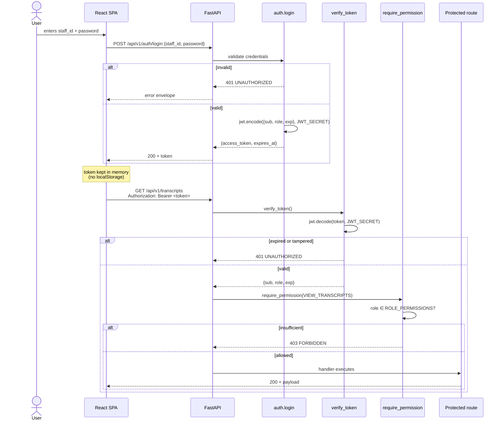
```mermaid
sequenceDiagram
    actor User
    participant SPA as React SPA
    participant API as FastAPI
    participant Auth as auth.login
    participant Dep as verify_token
    participant Perm as require_permission
    participant Route as Protected route

    User->>SPA: enters staff_id + password
    SPA->>API: POST /api/v1/auth/login {staff_id, password}
    API->>Auth: validate credentials
    alt invalid
        Auth-->>API: 401 UNAUTHORIZED
        API-->>SPA: error envelope
    else valid
        Auth->>Auth: jwt.encode({sub, role, exp}, JWT_SECRET)
        Auth-->>API: {access_token, expires_at}
        API-->>SPA: 200 + token
    end

    Note over SPA: token kept in memory<br/>(no localStorage)

    SPA->>API: GET /api/v1/transcripts<br/>Authorization: Bearer <token>
    API->>Dep: verify_token()
    Dep->>Dep: jwt.decode(token, JWT_SECRET)
    alt expired or tampered
        Dep-->>API: 401 UNAUTHORIZED
    else valid
        Dep-->>API: {sub, role, exp}
        API->>Perm: require_permission(VIEW_TRANSCRIPTS)
        Perm->>Perm: role ∈ ROLE_PERMISSIONS?
        alt insufficient
            Perm-->>API: 403 FORBIDDEN
        else allowed
            API->>Route: handler executes
            Route-->>SPA: 200 + payload
        end
    end
```

### 7.4 CORS Configuration

```python
# app/main.py, current implementation
app.add_middleware(
    CORSMiddleware,
    allow_origins=settings.cors_origins_list,    # env: CORS_ORIGINS, comma-separated
    allow_methods=["GET", "POST"],
    allow_headers=["Authorization", "Content-Type"],
)
```

`X-Staff-ID` and `X-Staff-Role` are intentionally **not** in `allow_headers`, they are no longer trusted inputs.

### 7.5 Observability and Audit Hardening

| Control | Detail |
|---------|--------|
| Correlation ID | `CorrelationIDMiddleware` sets/propagates `X-Correlation-ID`; included in every log line and audit row |
| Structured logging | `app/logging_config.py` configures `python-json-logger`; all logs are JSON Lines for ingestion by SIEM |
| Request log | `RequestLoggingMiddleware` records method, path, status, duration, correlation_id, actor_id (if auth'd), **no body, no headers** |
| Audit append-only | `AuditRepository.update()` / `.delete()` raise `OperationNotPermittedError` |
| Sentry | Optional `SENTRY_DSN`; PII scrubbing rules deny `Authorization`, `Cookie`, `password` keys |

### 7.6 Data Privacy Controls

| Control | Detail |
|---------|--------|
| No live data | Only synthetic / de-identified transcripts used during PoC |
| Log sanitization | Log messages reference `transcript_id` only, never student name or PII |
| LLM transmission | Transcript text sent to Google Gemini over HTTPS only; outbound host allow-listed |
| Audit detail scrubbing | `AuditLog.action_detail` JSON omits raw transcript text; references `transcript_id` for joins |
| Temp file cleanup | Uploaded files deleted after `FILE_RETENTION_HOURS` (default 24 h) via background task |
| Field-level encryption | Reserved for Phase B (DB-010), not in PoC scope |

---

## 8. Error Handling & Resilience

### 8.1 Error Code Reference

| Code | HTTP Status | Trigger Condition |
|------|-------------|------------------|
| `INVALID_FILE_TYPE` | 400 | File is not PDF / PNG / JPEG / TIFF |
| `FILE_TOO_LARGE` | 413 | File exceeds 10MB |
| `TRANSCRIPT_NOT_FOUND` | 404 | Transcript ID does not exist |
| `TRANSCRIPT_NOT_PROCESSED` | 409 | Attempting to review a transcript not yet verified |
| `FLAG_ALREADY_REVIEWED` | 409 | A review already exists for this flag |
| `EXTRACTION_FAILED` | 500 | OCR / pdfplumber returned empty text after all attempts |
| `LLM_UNAVAILABLE` | 503 | Gemini API unreachable after 3 retries |
| `LLM_PARSE_ERROR` | 500 | Gemini returned non-JSON or schema-invalid response |
| `OVERRIDE_REASON_REQUIRED` | 422 | Decision is OVERRIDDEN but `override_reason` is missing |
| `VALIDATION_ERROR` | 422 | Pydantic request body validation failure |

### 8.2 LLM Retry and Resilience Strategy

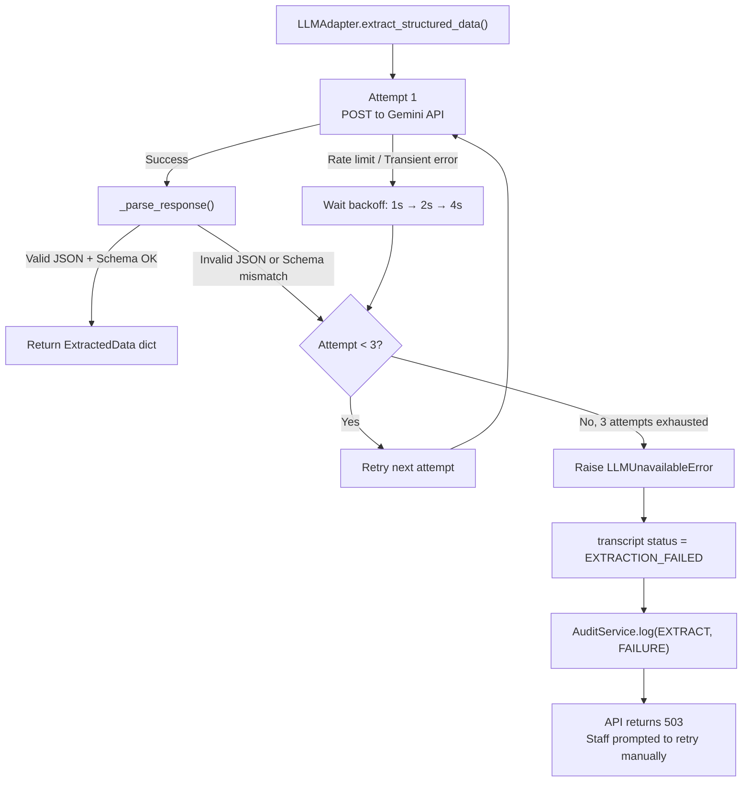
```mermaid
flowchart TD
    A["LLMAdapter.extract_structured_data()"] --> B["Attempt 1\nPOST to Gemini API"]
    B -->|"Success"| C["_parse_response()"]
    C -->|"Valid JSON + Schema OK"| D["Return ExtractedData dict"]
    C -->|"Invalid JSON or Schema mismatch"| E{"Attempt < 3?"}
    B -->|"Rate limit / Transient error"| F["Wait backoff: 1s → 2s → 4s"]
    F --> E
    E -->|"Yes"| G["Retry next attempt"]
    G --> B
    E -->|"No, 3 attempts exhausted"| H["Raise LLMUnavailableError"]
    H --> I["transcript status = EXTRACTION_FAILED"]
    I --> J["AuditService.log(EXTRACT, FAILURE)"]
    J --> K["API returns 503\nStaff prompted to retry manually"]
```

### 8.3 Global Exception Handler

```python
@app.exception_handler(MSBONBaseException)
async def msbon_exception_handler(request: Request, exc: MSBONBaseException):
    return JSONResponse(
        status_code=exc.http_status,
        content={
            "error": {
                "code": exc.code,
                "message": exc.message,
                "detail": exc.detail,
                "timestamp": datetime.utcnow().isoformat() + "Z",
            }
        },
    )
```

All custom exceptions (`InvalidFileTypeError`, `ExtractionFailedError`, `LLMUnavailableError`, etc.) inherit from `MSBONBaseException` and declare their own `http_status`, `code`, and default `message`.

---

## 9. Testing Strategy

### 9.1 Test Pyramid

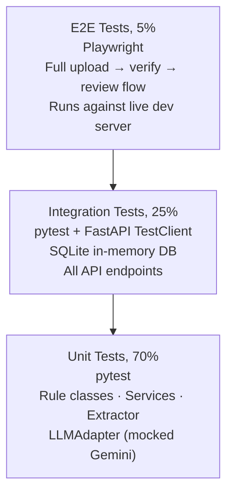
```mermaid
graph TB
    E2E["E2E Tests, 5%\nPlaywright\nFull upload → verify → review flow\nRuns against live dev server"]
    INT["Integration Tests, 25%\npytest + FastAPI TestClient\nSQLite in-memory DB\nAll API endpoints"]
    UNIT["Unit Tests, 70%\npytest\nRule classes · Services · Extractor\nLLMAdapter (mocked Gemini)"]

    E2E --> INT --> UNIT
```

### 9.2 Unit Test Coverage Targets

| Module | Key Test Cases |
|--------|---------------|
| `GraduationConfirmationRule` | `graduation_confirmed=True` (pass), `False` (flag), `graduation_date=null` (flag) |
| `AccreditationRule` | Exact name match, fuzzy match within threshold, no match, inactive program |
| `CourseCompletionRule` | All required courses present, one missing, credit hours below threshold |
| `FraudIndicatorRule` | BSN completed in 2 months (flag), normal timeline (pass), known fraud school (flag) |
| `FormattingConsistencyRule` | All fields present (pass), student_name null (flag), mixed date formats (flag) |
| `DocumentExtractor` | Valid text PDF, valid image (mocked tesseract), empty PDF (raises) |
| `LLMAdapter` | Success on attempt 1, success on attempt 2 (retry), all 3 fail, bad JSON |
| `ReviewService` | Valid CONFIRMED, valid OVERRIDDEN with reason, OVERRIDDEN without reason (422) |
| `AuditService` | Log creates entry, get_by_transcript returns all entries, no update allowed |

### 9.3 Integration Test Scenarios

| Test Scenario | Expected Outcome |
|---------------|-----------------|
| Upload valid PDF → process → all rules pass | `status=CLEAR`, `flags=[]` |
| Upload transcript, missing graduation confirmation | `status=FLAGGED`, GRAD-001 present |
| Upload transcript from unaccredited school | `status=FLAGGED`, ACCR-001 present |
| Submit OVERRIDDEN review without `override_reason` | `422 OVERRIDE_REASON_REQUIRED` |
| Submit valid review → check audit log | Audit entry with `action_type=REVIEW_FLAG` |
| Upload file > 10MB | `413 FILE_TOO_LARGE` |
| Upload `.exe` disguised as `.pdf` | `400 INVALID_FILE_TYPE` |
| `GET /audit-logs/{id}/export?format=csv` | Returns valid CSV binary |
| `GET /health` when DB connected | `{ "status": "healthy", "database": "connected" }` |

### 9.4 Synthetic Test Transcript Inventory

| Transcript ID | Description | Expected Flags |
|---------------|-------------|----------------|
| TEST-CLEAN-BSN | Valid BSN, all fields complete, ACEN-accredited school | None |
| TEST-CLEAN-ADN | Valid ADN, all fields complete, CCNE-accredited school | None |
| TEST-NO-GRAD | Transcript without graduation/degree conferral statement | GRAD-001 |
| TEST-NO-DATE | Graduation date field absent | GRAD-002 |
| TEST-PARTIAL | Incomplete program, missing required nursing courses | COUR-001 |
| TEST-FAST-COMPLETE | BSN granted 3 months after enrollment | FRAU-001 |
| TEST-UNKNOWN-SCHOOL | Institution not in accredited_programs table | ACCR-001 |
| TEST-FRAUD-SCHOOL | Institution matches known fraudulent program name | FRAU-003 |
| TEST-SCANNED | Low-quality scanned image transcript | Depends on OCR quality |
| TEST-FORMAT-BAD | Mixed date formats, missing credit hour fields | FORM-001, FORM-002 |

### 9.5 Acceptance Criteria (from Scope Document)

| Criterion | Target | How Measured |
|-----------|--------|-------------|
| Flag detection accuracy | ≥ 90% | Against synthetic test set |
| Flag explainability | 100% | Every flag has: rule ID + source excerpt + explanation |
| Audit completeness | 100% | Every state change produces an audit_log entry |
| Override traceability | 100% | Every OVERRIDDEN decision has a stored `override_reason` |
| No automated decisions | 100% | No endpoint approves or denies licensure |
| Staff usability | Positive feedback | Qualitative review with Dr. Burks, Dr. Smith, Talisha Greenlaw |

---

## 10. Non-Functional Requirements

| Category | Requirement | Target | Notes |
|----------|-------------|--------|-------|
| Performance | Upload response time | < 2 seconds | File save + DB insert |
| Performance | End-to-end verification | < 30 seconds | OCR + LLM + rules |
| Performance | Review submit response | < 1 second | DB insert only |
| Accuracy | Flag detection rate | ≥ 90% | Against synthetic test set |
| Explainability | Flags with full explanation | 100% | Scope requirement |
| Auditability | Actions logged | 100% | Zero unlogged state changes |
| Security | File size limit | 10 MB | Enforced at API middleware |
| Security | Accepted file types | PDF, PNG, JPEG, TIFF | Validated by magic bytes |
| Privacy | Temp file retention | ≤ 24 hours | Configurable via `FILE_RETENTION_HOURS` |
| Compatibility | Browser support | Chrome 120+, Firefox 120+, Edge 120+ | |
| Runtime | Python version | 3.11+ | |
| Runtime | Node.js version | 18+ | |

---

## 11. Appendix

### 11.1 Project Directory Structure

```
msbon-app/
├── backend/
│   ├── app/
│   │   ├── __init__.py
│   │   ├── main.py                         # FastAPI app factory, CORS, routers
│   │   ├── config.py                       # pydantic-settings, loads .env
│   │   ├── database.py                     # SQLAlchemy engine + session dependency
│   │   │
│   │   ├── api/
│   │   │   └── v1/
│   │   │       ├── __init__.py
│   │   │       ├── transcripts.py
│   │   │       ├── reviews.py
│   │   │       ├── audit.py
│   │   │       ├── programs.py
│   │   │       └── health.py
│   │   │
│   │   ├── services/
│   │   │   ├── transcript_service.py
│   │   │   ├── extraction_service.py
│   │   │   ├── verification_service.py
│   │   │   ├── review_service.py
│   │   │   └── audit_service.py
│   │   │
│   │   ├── domain/
│   │   │   ├── rule_engine.py
│   │   │   └── rules/
│   │   │       ├── __init__.py
│   │   │       ├── base_rule.py
│   │   │       ├── graduation_rule.py
│   │   │       ├── accreditation_rule.py
│   │   │       ├── course_completion_rule.py
│   │   │       ├── fraud_indicator_rule.py
│   │   │       └── formatting_rule.py
│   │   │
│   │   ├── infrastructure/
│   │   │   ├── document_extractor.py
│   │   │   └── llm_adapter.py
│   │   │
│   │   ├── models/
│   │   │   ├── orm/
│   │   │   │   ├── __init__.py
│   │   │   │   ├── transcript.py
│   │   │   │   ├── extracted_data.py
│   │   │   │   ├── verification_flag.py
│   │   │   │   ├── staff_review.py
│   │   │   │   ├── audit_log.py
│   │   │   │   ├── flagging_rule.py
│   │   │   │   └── accredited_program.py
│   │   │   └── schemas/
│   │   │       ├── transcript.py
│   │   │       ├── review.py
│   │   │       ├── audit.py
│   │   │       └── program.py
│   │   │
│   │   └── repositories/
│   │       ├── base_repository.py
│   │       ├── transcript_repository.py
│   │       ├── review_repository.py
│   │       ├── audit_repository.py
│   │       └── program_repository.py
│   │
│   ├── migrations/
│   │   ├── env.py
│   │   └── versions/
│   │
│   ├── tests/
│   │   ├── unit/
│   │   │   ├── test_rules.py
│   │   │   ├── test_services.py
│   │   │   ├── test_extractor.py
│   │   │   └── test_llm_adapter.py
│   │   ├── integration/
│   │   │   ├── test_transcripts_api.py
│   │   │   ├── test_reviews_api.py
│   │   │   └── test_audit_api.py
│   │   └── fixtures/
│   │       ├── synthetic_transcripts/
│   │       └── conftest.py
│   │
│   ├── data/                    # gitignored, SQLite DB file
│   ├── uploads/                 # gitignored, temp transcript storage
│   ├── logs/                    # gitignored, app log files
│   ├── requirements.txt
│   ├── requirements-dev.txt
│   ├── alembic.ini
│   └── .env.example
│
├── frontend/
│   ├── src/
│   │   ├── pages/
│   │   │   ├── UploadPage.tsx
│   │   │   ├── TranscriptListPage.tsx
│   │   │   ├── VerificationPage.tsx
│   │   │   ├── AuditLogPage.tsx
│   │   │   └── ProgramsPage.tsx
│   │   ├── components/
│   │   │   ├── upload/
│   │   │   │   ├── FileDropzone.tsx
│   │   │   │   └── UploadProgressBar.tsx
│   │   │   ├── verification/
│   │   │   │   ├── TranscriptSummary.tsx
│   │   │   │   ├── FlagList.tsx
│   │   │   │   ├── FlagItem.tsx
│   │   │   │   └── RuleExplanation.tsx
│   │   │   ├── review/
│   │   │   │   ├── ReviewForm.tsx
│   │   │   │   ├── DecisionButtons.tsx
│   │   │   │   └── AnnotationInput.tsx
│   │   │   └── audit/
│   │   │       ├── AuditLogTable.tsx
│   │   │       ├── AuditLogFilters.tsx
│   │   │       └── ExportButton.tsx
│   │   ├── services/
│   │   │   ├── transcriptClient.ts
│   │   │   ├── reviewClient.ts
│   │   │   └── auditClient.ts
│   │   ├── store/
│   │   │   └── uiStore.ts
│   │   ├── types/
│   │   │   └── index.ts
│   │   ├── App.tsx
│   │   └── main.tsx
│   ├── package.json
│   ├── vite.config.ts            # Proxy /api → localhost:8000
│   └── tsconfig.json
│
├── docs/
│   └── Software_Design_Document.md
└── README.md
```

### 11.2 Environment Variables

**`backend/.env`:**
```env
# Google Gemini
GEMINI_API_KEY=AIza...
GEMINI_MODEL=gemini-2.0-flash

# Database
DATABASE_URL=sqlite:///./data/msbon.db

# File storage
UPLOAD_DIR=./uploads
MAX_FILE_SIZE_MB=10
FILE_RETENTION_HOURS=24

# App
LOG_LEVEL=INFO
CORS_ORIGINS=http://localhost:5173
APP_VERSION=1.0.0-poc
```

**`frontend/.env`:**
```env
VITE_API_BASE_URL=http://localhost:8000/api/v1
```

### 11.3 Backend Dependency Manifest

**`requirements.txt`:**
```
fastapi==0.110.0
uvicorn[standard]==0.27.0
sqlalchemy==2.0.29
alembic==1.13.1
pydantic==2.6.4
pydantic-settings==2.2.1
google-generativeai==0.5.0
pdfplumber==0.11.0
pytesseract==0.3.10
Pillow==10.3.0
python-multipart==0.0.9
python-magic==0.4.27
```

**`requirements-dev.txt`:**
```
pytest==8.1.1
httpx==0.27.0
pytest-asyncio==0.23.6
faker==24.3.0
```

### 11.4 Frontend Dependency Manifest

| Package | Version | Purpose |
|---------|---------|---------|
| react | ^18.3.0 | UI framework |
| react-dom | ^18.3.0 | DOM rendering |
| react-router-dom | ^6.22.3 | SPA routing |
| @tanstack/react-query | ^5.28.0 | Server state management + caching |
| zustand | ^4.5.2 | Client UI state |
| axios | ^1.6.8 | HTTP client for API calls |
| tailwindcss | ^3.4.0 | Utility-first CSS |
| typescript | ^5.4.0 | Type safety |
| vite | ^5.2.0 | Build tool + dev server |
| @vitejs/plugin-react | ^4.2.0 | React Fast Refresh |

### 11.5 Flagging Rules Seed Data

The following 12 records are inserted into `flagging_rules` at database initialization:

| rule_id | name | category | severity | is_active |
|---------|------|----------|----------|-----------|
| GRAD-001 | Missing graduation confirmation | GRADUATION | HIGH | true |
| GRAD-002 | Graduation date absent | GRADUATION | MEDIUM | true |
| ACCR-001 | Institution not in MS accredited list | ACCREDITATION | HIGH | true |
| ACCR-002 | Accreditation body not recognized | ACCREDITATION | MEDIUM | true |
| COUR-001 | Required nursing courses not present | COURSE | HIGH | true |
| COUR-002 | Insufficient credit hours | COURSE | MEDIUM | true |
| FRAU-001 | Program completion time below minimum | FRAUD | HIGH | true |
| FRAU-002 | Suspicious grade distribution | FRAUD | MEDIUM | true |
| FRAU-003 | Institution on fraud watch list | FRAUD | HIGH | true |
| FORM-001 | Required transcript fields missing | FORMAT | LOW | true |
| FORM-002 | Inconsistent date formatting | FORMAT | LOW | true |
| FORM-003 | Inconsistent grade formatting | FORMAT | LOW | true |
