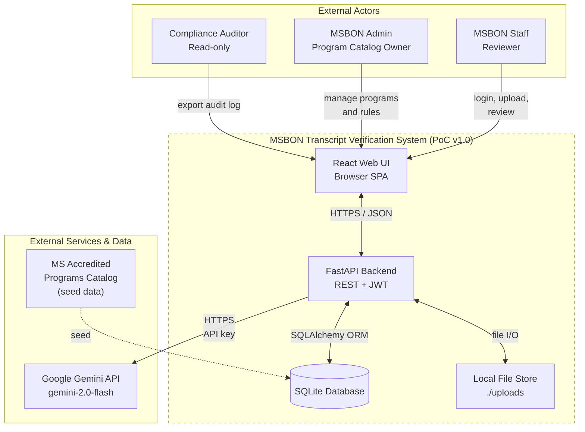
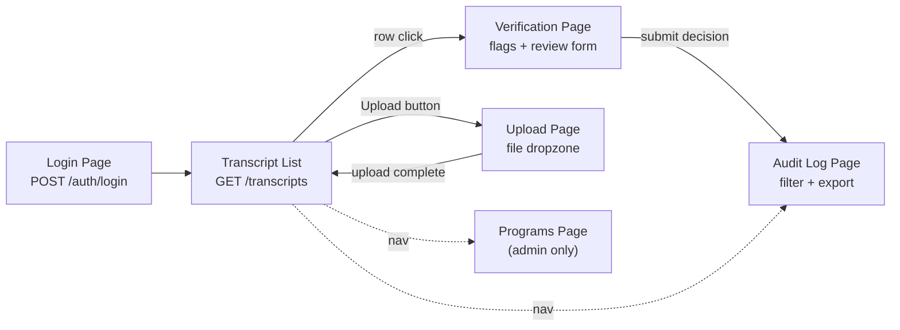
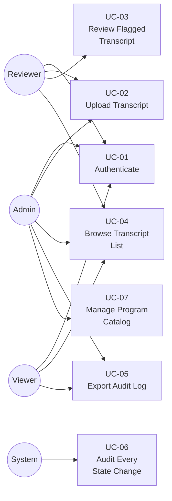
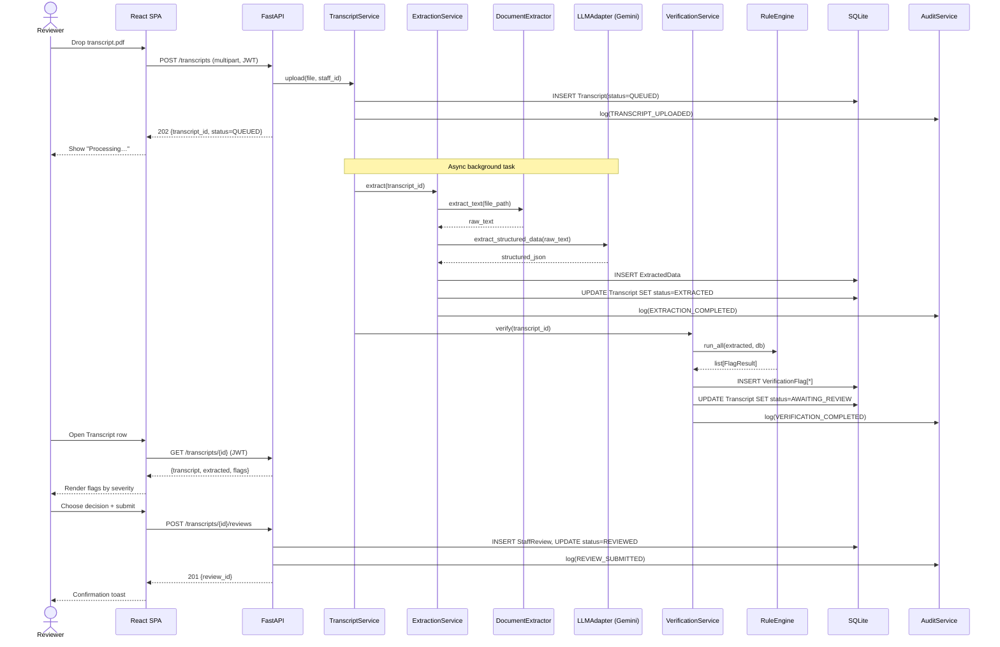
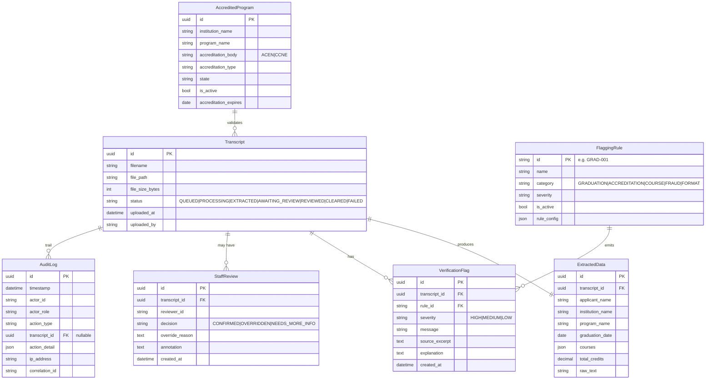
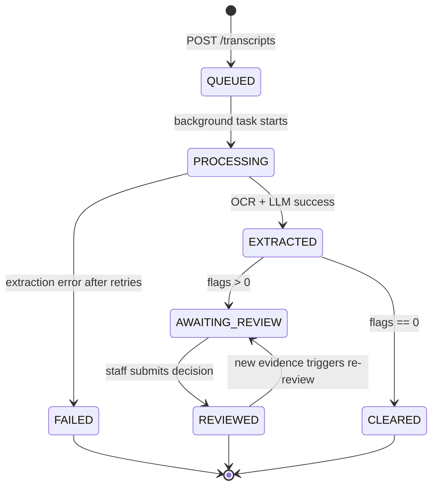

# Software Requirements Specification
## MSBON Fraud-Sensitive Transcript Verification System
### Version 1.0 | Team Nexus | University of Southern Mississippi | CSC 424 Capstone

---

## Revision History

| Version | Date | Author | Description |
|---------|------|--------|-------------|
| 0.1 | 2026-05-12 | Team Nexus | Initial draft of capstone SRS |
| 1.0 | 2026-05-12 | Team Nexus | Baseline SRS — PoC scope, IEEE 830 structure |

---

## Table of Contents

1. [Introduction](#1-introduction)
2. [Overall Description](#2-overall-description)
3. [External Interface Requirements](#3-external-interface-requirements)
4. [Functional Requirements](#4-functional-requirements)
5. [Non-Functional Requirements](#5-non-functional-requirements)
6. [Use Cases](#6-use-cases)
7. [Data Requirements](#7-data-requirements)
8. [System Constraints and Compliance](#8-system-constraints-and-compliance)
9. [Acceptance Criteria and Traceability Matrix](#9-acceptance-criteria-and-traceability-matrix)
10. [Appendix](#10-appendix)

---

## 1. Introduction

### 1.1 Purpose

This Software Requirements Specification (SRS) defines the complete functional, non-functional, interface, and data requirements for the **MSBON Fraud-Sensitive Transcript Verification System** — a Proof of Concept (PoC) developed by Team Nexus for the Mississippi State Board of Nursing (MSBON) under the CSC 424 Senior Capstone at The University of Southern Mississippi. This document is the binding contract between the development team and the customer (MSBON). It tells the customer exactly **what** the delivered system will do; the companion Software Design Document (SDD) explains **how** the system implements these requirements.

This SRS conforms to IEEE Std 830-1998 in spirit, adapted for an academic capstone deliverable and a single-cycle PoC release. It is the authoritative input to test plans, acceptance review, and the end-of-semester demonstration.

### 1.2 Scope

#### 1.2.1 Product Identification

The product is named **MSBON Transcript Verification System**, version `1.0.0-poc`. It is delivered as a self-contained web application consisting of a FastAPI HTTP backend (Python 3.11+) and a React 18 single-page frontend (TypeScript + Vite + Tailwind CSS), backed by SQLite for the PoC.

#### 1.2.2 What the Product Does

The system automates the **first-pass review** of nursing school transcripts submitted to MSBON for licensure applications. Specifically it shall:

1. **Ingest** transcript documents (PDF or scanned image) uploaded by authorized MSBON staff.
2. **Extract** structured data from each document using a two-stage pipeline: deterministic OCR/text extraction (`pdfplumber` + Tesseract) followed by a Large Language Model (Google Gemini `gemini-2.0-flash`) that produces normalized JSON.
3. **Verify** the extracted data against twelve transparent, rule-based fraud and compliance checks across five categories: Graduation, Accreditation, Course Completion, Fraud Indicators, and Formatting.
4. **Surface** every flag with a human-readable explanation, source excerpt, and severity to the reviewing staff member.
5. **Capture** the staff member's decision — *Confirmed*, *Overridden*, or *Needs More Information* — along with a free-text justification when required.
6. **Persist** every state change in a tamper-evident audit log that is exportable as CSV or JSON for compliance review.

#### 1.2.3 What the Product Does NOT Do (Out of Scope)

| # | Out of Scope | Rationale |
|---|--------------|-----------|
| 1 | Issue, deny, or revoke a nursing license | All licensure decisions remain with human MSBON staff per board statute. |
| 2 | Process foreign (non-U.S.) transcripts | Foreign credential evaluation is delegated to CGFNS in the production process. |
| 3 | Communicate with applicants | The system has no applicant-facing surface in this PoC. |
| 4 | Long-term storage of original transcript files | Source files are deleted after configurable retention (default 24 h). |
| 5 | Integrate with MSBON's production licensing database | PoC is air-gapped from production data. |
| 6 | Provide HIPAA/PHI-grade encryption-at-rest | Field-level encryption planned for Phase D infrastructure work. |

#### 1.2.4 Benefits and Objectives

| Benefit | Measurable Objective |
|---------|----------------------|
| Reduce manual transcript review time | First-pass triage in ≤ 30 s per transcript at 95th percentile |
| Increase fraud detection sensitivity | ≥ 90 % flag accuracy against the synthetic test transcript set |
| Provide complete audit trail | 100 % of state changes produce an audit entry; 0 audit gaps |
| Preserve human authority | 100 % of OVERRIDDEN decisions store a justification |
| Make decisions explainable | Every flag carries rule ID + source excerpt + plain-language explanation |

### 1.3 Definitions, Acronyms, and Abbreviations

| Term | Definition |
|------|------------|
| MSBON / MSBN | Mississippi State Board of Nursing — the customer |
| PoC | Proof of Concept — capstone deliverable, not production |
| OCR | Optical Character Recognition (Tesseract via `pytesseract`) |
| LLM | Large Language Model (Google Gemini `gemini-2.0-flash`) |
| SRS / SRD | Software Requirements Specification / Software Requirements Document |
| SDD | Software Design Document — companion document |
| ACEN | Accreditation Commission for Education in Nursing |
| CCNE | Commission on Collegiate Nursing Education |
| ADN / BSN / MSN | Associate / Bachelor / Master of Science in Nursing |
| API | Application Programming Interface |
| REST | Representational State Transfer |
| RBAC | Role-Based Access Control |
| JWT | JSON Web Token (RFC 7519) |
| ORM | Object-Relational Mapper |
| SPA | Single Page Application |
| FERPA | Family Educational Rights and Privacy Act |
| WCAG | Web Content Accessibility Guidelines |
| Operation Nightingale | 2023 federal investigation into fraudulent nursing diplomas |
| Flag | A finding produced by a verification rule (rule_id, severity, message, source excerpt) |
| Rule | A deterministic predicate evaluating extracted transcript data |
| Reviewer | An MSBON staff member with the `reviewer` role |
| Decision | One of `CONFIRMED`, `OVERRIDDEN`, or `NEEDS_MORE_INFO` |

### 1.4 References

| # | Reference |
|---|-----------|
| R-1 | MSBON PoC Scope Document, January 7 2026 |
| R-2 | MSBON Project Concept, Team Nexus, February 27 2026 |
| R-3 | Software Design Document (SDD), Team Nexus, v1.0 — `Software_Design_Document.md` |
| R-4 | Phase 1 Audit Report, 2026-03-29 — `msbon-app/docs/PHASE1_AUDIT_REPORT.md` |
| R-5 | Phase 2 Implementation Blueprint, 2026-03-29 — `msbon-app/docs/PHASE2_BLUEPRINT.md` |
| R-6 | IEEE Std 830-1998, *Recommended Practice for Software Requirements Specifications* |
| R-7 | OWASP Top 10 (2021) |
| R-8 | NIST SP 800-63B (digital identity guidelines) |
| R-9 | WCAG 2.1 Level AA |
| R-10 | ACEN and CCNE accreditation standards (publicly published) |
| R-11 | FastAPI documentation, `https://fastapi.tiangolo.com/` |
| R-12 | Google Gemini API documentation, `https://ai.google.dev/` |
| R-13 | Operation Nightingale federal indictment, U.S. Attorney for the Southern District of Florida, 2023 |

### 1.5 Document Overview

Section 2 paints the system in broad strokes: where it sits in the MSBON workflow, who uses it, and what constraints it operates under. Section 3 enumerates every interface the system presents — to users, to other software, and to the network. Section 4 contains the catalog of functional requirements (REQ-FR-***), each numbered, prioritized, and traceable to a use case. Section 5 covers the non-functional requirements (performance, security, reliability, usability). Section 6 captures the primary use cases as actor flows. Section 7 specifies the data model. Section 8 lists external constraints and compliance obligations. Section 9 defines the acceptance criteria and a traceability matrix linking every requirement to a test or demo step. Section 10 holds the appendices.

---

## 2. Overall Description

### 2.1 Product Perspective

The MSBON Transcript Verification System is a **new, self-contained product** with no dependency on existing MSBON information systems. It is intended to be operated on a workstation or private server inside the MSBON network. The system *consumes* one external service (the Google Gemini API over HTTPS) and *produces* output that is exclusively read by human MSBON staff. It is not a component of a larger system in this PoC; integration with the production licensing database is explicitly deferred to a follow-on engagement.

#### 2.1.1 System Context Diagram

The diagram below shows the system boundary, the external actors, and the external services. Anything inside the dashed box is delivered by Team Nexus; everything outside is supplied or operated by another party.



### 2.2 Product Functions

The system implements seven top-level capabilities. Each is broken down into specific functional requirements in Section 4.

| # | Capability | Primary Actor | FR Range |
|---|------------|---------------|----------|
| F1 | Authenticate and authorize staff members (RBAC) | Reviewer / Admin | FR-001 – FR-010 |
| F2 | Upload nursing transcripts (PDF or image) | Reviewer / Admin | FR-020 – FR-029 |
| F3 | Extract structured data via OCR + LLM | System (background task) | FR-030 – FR-039 |
| F4 | Apply 12 transparent verification rules | System | FR-040 – FR-052 |
| F5 | Review, annotate, and decide on flagged transcripts | Reviewer | FR-060 – FR-074 |
| F6 | Maintain tamper-evident audit log | System (write-only) | FR-080 – FR-089 |
| F7 | Manage accredited program catalog | Admin | FR-090 – FR-099 |

### 2.3 User Classes and Characteristics

| User Class | Count | Frequency | Technical Skill | Privileges (RBAC) |
|------------|-------|-----------|------------------|--------------------|
| **Reviewer** (MSBON licensure staff) | ~5–15 | Daily | Comfortable with web apps; not technical | Upload, list, review, annotate; cannot manage rules or programs |
| **Admin** (MSBON IT / program catalog owner) | 1–2 | Weekly | Technically literate | All Reviewer rights + manage programs, rules, view system status |
| **Viewer** (Compliance auditor) | 1–3 | Quarterly | Audit-focused | Read-only access to transcripts and audit log; no upload, no review |
| **Developer** (Team Nexus, capstone team) | 5 | During development only | Full-stack | Direct DB / filesystem access in dev environment only |

The **Reviewer** is the primary user — interface design (font size, contrast, button placement, plain-language flag explanations) is optimized for this class first.

### 2.4 Operating Environment

| Element | Specification |
|---------|---------------|
| Server OS | macOS 13+, Ubuntu 22.04 LTS, or Windows 11 (PoC supports any platform with Python 3.11) |
| Server Runtime | Python 3.11+, Node.js 18+ (build only) |
| Server Hardware | 4 GB RAM minimum, 10 GB free disk for uploads + DB; no GPU required |
| Database | SQLite 3.39+ (PoC); upgrade path to PostgreSQL 15+ documented in SDD §11.2 |
| Client | Any evergreen browser supporting ES2022 (Chrome 110+, Firefox 110+, Safari 16+, Edge 110+) |
| Client Hardware | Standard office workstation; 1366×768 minimum display |
| Network | Local or private network; outbound HTTPS to `generativelanguage.googleapis.com` for LLM calls |
| External Service | Google Gemini API (active API key required) |

### 2.5 Design and Implementation Constraints

| # | Constraint | Origin |
|---|------------|--------|
| C-1 | Backend language must be Python (FastAPI) | Course tooling alignment + team skill |
| C-2 | Frontend must be React + TypeScript | Course tooling alignment |
| C-3 | LLM provider must be Google Gemini for the PoC | Customer-supplied API access |
| C-4 | All AI outputs are advisory; no automated licensure decisions | MSBON board policy |
| C-5 | Only synthetic or de-identified transcript data may be used during development | FERPA / privacy |
| C-6 | All source code, scripts, and documents under git version control | CSC 424 capstone tooling requirement |
| C-7 | Mermaid is the canonical diagramming notation for both SRS and SDD | Team standard; CI-renderable |
| C-8 | The product must be demonstrable end-to-end in a recorded video at semester end | CSC 424 presentation deliverable |
| C-9 | No long-term retention of raw transcript files | Privacy + storage cost |

### 2.6 Assumptions and Dependencies

| # | Assumption / Dependency | If Violated |
|---|-------------------------|-------------|
| A-1 | A valid Google Gemini API key is provisioned in `GEMINI_API_KEY` | Extraction fails with `LLM_UNAVAILABLE`; uploads queue but never process |
| A-2 | Tesseract OCR is installed on the host (`brew install tesseract` / `apt install tesseract-ocr`) | Image-based transcripts cannot be extracted |
| A-3 | `libmagic` is installed for MIME validation (`brew install libmagic`) | File-type detection falls back to extension only — security regression |
| A-4 | The MSBON-approved accredited program list is seeded into the database | ACCR-001 / ACCR-002 rules over-flag every transcript |
| A-5 | Reviewers are trained on what each flag category means | Decision quality degrades; `OVERRIDDEN` rate spikes |
| A-6 | Network access to `generativelanguage.googleapis.com` is permitted | Same as A-1 |

---

## 3. External Interface Requirements

### 3.1 User Interfaces

The system provides a single web-based UI served at `http://<host>:5173` in development (and a static-asset bundle for deployment). The information architecture is summarized below.



**UI requirements:**

| ID | Requirement |
|----|-------------|
| UI-001 | The UI shall present a top-level navigation with links: Transcripts, Upload, Programs (admin-only), Audit Log, and a session indicator (logged-in user, role, log-out). |
| UI-002 | The UI shall be operable on viewports 1366×768 and larger; mobile responsiveness is *not* required for the PoC. |
| UI-003 | The UI shall conform to WCAG 2.1 Level AA contrast ratios for all text on background. |
| UI-004 | All actionable controls shall be reachable by keyboard navigation (Tab / Shift-Tab / Enter / Space). |
| UI-005 | Status indicators (transcript status, flag severity) shall convey meaning by *both* color and text/icon — never color alone. |
| UI-006 | All asynchronous operations (upload, processing, submit) shall display either a deterministic progress indicator or a textual "in progress" state within 200 ms of trigger. |
| UI-007 | Server-side errors shall be surfaced to the user with the human-readable `error.message` field; raw stack traces shall never be displayed. |
| UI-008 | The UI shall obey the design tokens defined in `frontend/docs/DESIGN_TOKENS.md` (no hardcoded colors). |

### 3.2 Hardware Interfaces

The system imposes no special hardware requirements beyond the operating environment in §2.4. There is no integration with scanners, ID readers, biometric devices, or printers in the PoC scope.

### 3.3 Software Interfaces

| Interface | Direction | Protocol | Auth | Notes |
|-----------|-----------|----------|------|-------|
| Browser → Backend REST API | Bidirectional | HTTPS, JSON | JWT bearer (header `Authorization: Bearer <token>`) | All endpoints under `/api/v1/` |
| Backend → Google Gemini | Outbound | HTTPS | API key (env var `GEMINI_API_KEY`) | Endpoint `generativelanguage.googleapis.com`; `gemini-2.0-flash` model |
| Backend → SQLite | Local | SQLAlchemy ORM | Filesystem permissions | DSN `sqlite:///./data/msbon.db`; Alembic-managed schema |
| Backend → Local file store | Local | POSIX file I/O | Filesystem permissions | Files written as `{uuid}.{ext}` under `./uploads`, MIME-validated via `libmagic` |
| Backend → Tesseract | Subprocess | `pytesseract` shell-out | none | Used by `DocumentExtractor` for image transcripts |

### 3.4 Communications Interfaces

| ID | Requirement |
|----|-------------|
| COM-001 | All HTTP traffic in production deployment shall use TLS 1.2 or higher. (PoC dev mode permits plain HTTP on `127.0.0.1`.) |
| COM-002 | The backend shall accept CORS pre-flight requests only from origins listed in `CORS_ORIGINS` (default `http://localhost:5173`). |
| COM-003 | The backend shall expose its OpenAPI 3.1 schema at `/openapi.json` and an interactive Swagger UI at `/docs`. |
| COM-004 | All error responses shall conform to a uniform envelope `{"error": {"code", "message", "detail", "timestamp"}}`. |
| COM-005 | The backend shall propagate or generate an `X-Correlation-ID` header on every request and include it in every log line for that request. |

---

## 4. Functional Requirements

> Each requirement is identified `REQ-FR-NNN`, has a **Priority** (Must / Should / May per MoSCoW), and traces to one or more use cases in §6.
>
> *Must* = required for capstone demo and acceptance.
> *Should* = scheduled for the PoC but acceptable to defer with justification.
> *May* = stretch goal; included only if time permits.

### 4.1 Authentication and Authorization (F1)

| ID | Requirement | Priority | Trace |
|----|-------------|:--------:|-------|
| FR-001 | The system shall authenticate users via a `POST /api/v1/auth/login` endpoint accepting `staff_id` and `password`, returning a signed JWT with payload `{sub, role, exp}`. | Must | UC-01 |
| FR-002 | The system shall reject login attempts with invalid credentials with HTTP 401 and the error envelope from COM-004. | Must | UC-01 |
| FR-003 | Issued JWTs shall expire after a configurable interval (default 480 minutes = 8-hour shift). | Must | UC-01 |
| FR-004 | Every protected endpoint shall require a valid JWT in the `Authorization: Bearer` header. | Must | All UCs |
| FR-005 | The system shall implement role-based access control with three roles: `admin`, `reviewer`, `viewer`. | Must | UC-01–UC-07 |
| FR-006 | The system shall enforce permissions per role as defined in `app/auth/permissions.py` (Admin: all; Reviewer: upload + review; Viewer: read-only). | Must | UC-01–UC-07 |
| FR-007 | The system shall reject requests carrying expired or tampered tokens with HTTP 401. | Must | All UCs |
| FR-008 | Client-supplied identity headers (`X-Staff-ID`, `X-Staff-Role`) shall *never* be used for authorization decisions. | Must | UC-01 |
| FR-009 | The system shall log every successful login and every authorization failure to the audit log (`AUTH_LOGIN`, `AUTH_DENIED`). | Must | UC-06 |
| FR-010 | The system *should* redirect a user to the login page upon receiving an HTTP 401 from any API call. | Should | UC-01 |

### 4.2 Transcript Upload (F2)

| ID | Requirement | Priority | Trace |
|----|-------------|:--------:|-------|
| FR-020 | The system shall accept transcript uploads via `POST /api/v1/transcripts` as `multipart/form-data` with a single `file` part. | Must | UC-02 |
| FR-021 | Accepted file types shall be: `application/pdf`, `image/png`, `image/jpeg`, `image/tiff`. | Must | UC-02 |
| FR-022 | File type shall be validated by inspecting magic bytes (via `python-magic`), *not* by trusting the filename extension. | Must | UC-02 |
| FR-023 | Maximum accepted file size shall be configurable (`MAX_FILE_SIZE_MB`, default 10 MB); larger files shall be rejected with HTTP 413. | Must | UC-02 |
| FR-024 | Uploaded files shall be stored under `UPLOAD_DIR` with a randomized name `{uuid}.{ext}`; the original filename shall be preserved as metadata only. | Must | UC-02 |
| FR-025 | A successful upload shall return HTTP 202 with a JSON body containing `{transcript_id, status: "QUEUED"}` and trigger an asynchronous extraction task. | Must | UC-02 |
| FR-026 | The system shall create an audit entry (`TRANSCRIPT_UPLOADED`) for every successful upload, recording `transcript_id`, `staff_id`, `filename`, `file_size`, and timestamp. | Must | UC-06 |
| FR-027 | If validation fails, no file shall be persisted to disk and no DB row shall be created. | Must | UC-02 |
| FR-028 | The system *should* delete uploaded files after `FILE_RETENTION_HOURS` (default 24 h) once processing is complete. | Should | UC-02 |
| FR-029 | The UI *should* display a deterministic upload progress bar driven by the XHR `onprogress` event. | Should | UC-02 |

### 4.3 Document Extraction (F3)

| ID | Requirement | Priority | Trace |
|----|-------------|:--------:|-------|
| FR-030 | The system shall extract raw text from PDF transcripts using `pdfplumber`. | Must | UC-02 |
| FR-031 | The system shall extract raw text from image transcripts using Tesseract via `pytesseract`. | Must | UC-02 |
| FR-032 | Image inputs shall be preprocessed (grayscale conversion, contrast enhancement) before OCR. | Should | UC-02 |
| FR-033 | The extracted raw text shall be passed to the Google Gemini LLM with a deterministic prompt template that returns JSON conforming to the schema in §7.2. | Must | UC-02 |
| FR-034 | The LLM adapter shall validate the response against the JSON schema; non-conforming responses shall be retried (≤ 3 attempts) with exponential back-off (1 s, 2 s, 4 s). | Must | UC-02 |
| FR-035 | If all retries fail, the transcript status shall be set to `FAILED` and an audit entry `EXTRACTION_FAILED` shall be created with the underlying error code. | Must | UC-02, UC-06 |
| FR-036 | The system shall persist extracted data as a `ExtractedData` row linked one-to-one with `Transcript`. | Must | UC-02 |
| FR-037 | Upon successful extraction, the transcript status shall transition `QUEUED → PROCESSING → EXTRACTED`. | Must | UC-02 |
| FR-038 | The Gemini API key shall be read from environment variables only; it shall never appear in logs, error messages, or HTTP responses. | Must | NFR-SEC |
| FR-039 | The system *may* support pluggable LLM providers via an `LLMAdapter` interface for future replacement. | May | — |

### 4.4 Verification (Rule Engine) (F4)

| ID | Requirement | Priority | Trace |
|----|-------------|:--------:|-------|
| FR-040 | After successful extraction, the system shall automatically invoke the Rule Engine over the extracted JSON. | Must | UC-02 |
| FR-041 | The Rule Engine shall load the active rule set from the `flagging_rules` table (only rows with `is_active=true`). | Must | UC-02 |
| FR-042 | The system shall implement and ship the following twelve rules — see §10.2 for the canonical reference: GRAD-001, GRAD-002, ACCR-001, ACCR-002, COUR-001, COUR-002, FRAU-001, FRAU-002, FRAU-003, FORM-001, FORM-002, FORM-003. | Must | UC-02, UC-03 |
| FR-043 | Every emitted flag shall include `rule_id`, `severity` (HIGH / MEDIUM / LOW), `message`, `source_excerpt` (verbatim text from the transcript), and `explanation` (≥ 1 plain-language sentence). | Must | UC-03 |
| FR-044 | Verification results shall be persisted as `VerificationFlag` rows linked to the parent transcript. | Must | UC-02 |
| FR-045 | Upon completion, the transcript status shall transition `EXTRACTED → AWAITING_REVIEW` if any flags exist, or `EXTRACTED → CLEARED` if zero flags. | Must | UC-02 |
| FR-046 | An audit entry `VERIFICATION_COMPLETED` shall be written with the flag count and rule IDs that fired. | Must | UC-06 |
| FR-047 | The system shall allow the active rule set to be modified by an `admin` user via `PATCH /api/v1/rules/{rule_id}` (toggle `is_active`). | Should | UC-07 |
| FR-048 | Rule evaluation shall be deterministic: identical extracted JSON + identical active rule set shall always yield identical flags. | Must | NFR-REL |
| FR-049 | A failure inside any single rule shall not prevent other rules from running; the failed rule shall produce a flag of severity HIGH with `rule_id="RULE_INTERNAL_ERROR"`. | Should | NFR-REL |
| FR-050 | The system *should* allow admins to add custom rules via configuration without code changes (post-PoC). | May | — |
| FR-051 | The Rule Engine shall complete evaluation of a single transcript within 2 s on PoC reference hardware (M1 MacBook). | Must | NFR-PERF |
| FR-052 | Accreditation rules shall consult the `accredited_programs` catalog (institution name, body, `is_active`); rules shall *not* hardcode program names. | Must | UC-07 |

### 4.5 Staff Review and Decision (F5)

| ID | Requirement | Priority | Trace |
|----|-------------|:--------:|-------|
| FR-060 | The system shall provide `GET /api/v1/transcripts` returning a paginated list filterable by status. | Must | UC-04 |
| FR-061 | The system shall provide `GET /api/v1/transcripts/{id}` returning the transcript, its extracted data, and all flags. | Must | UC-03 |
| FR-062 | The Verification page shall display flags grouped by severity (HIGH first, then MEDIUM, then LOW). | Must | UC-03 |
| FR-063 | Each flag shall be expandable to show the `source_excerpt` and `explanation` inline. | Must | UC-03 |
| FR-064 | The Review form shall provide three exclusive decision controls — `CONFIRMED`, `OVERRIDDEN`, `NEEDS_MORE_INFO` — selectable by mouse or keyboard. | Must | UC-03 |
| FR-065 | If `OVERRIDDEN` is selected, the user shall be required to enter an `override_reason` of at least 10 characters before submission. | Must | UC-03 |
| FR-066 | Submission shall be a single `POST /api/v1/transcripts/{id}/reviews` carrying `{decision, override_reason?, annotation?}`. | Must | UC-03 |
| FR-067 | Upon successful submission, the transcript status shall transition to `REVIEWED` and an audit entry `REVIEW_SUBMITTED` shall be written. | Must | UC-03, UC-06 |
| FR-068 | A transcript may be reviewed multiple times; each review shall be persisted as a separate `StaffReview` row. The most recent decision is the operative one. | Should | UC-03 |
| FR-069 | The system shall reject review submissions on transcripts whose status is not in `{AWAITING_REVIEW, REVIEWED}` with HTTP 409. | Must | UC-03 |
| FR-070 | A reviewer with the `viewer` role shall be able to read flags but shall be denied submission with HTTP 403. | Must | UC-03 |
| FR-071 | The system shall record `reviewer_id` from the JWT `sub` claim — never from a request body field. | Must | NFR-SEC |
| FR-072 | The UI shall provide a confirmation prompt (modal or inline) before a `OVERRIDDEN` submission is sent. | Should | UC-03 |
| FR-073 | The system shall allow free-text reviewer annotations of up to 2,000 characters per review. | Should | UC-03 |
| FR-074 | The system *may* allow attaching supporting documents to a review (post-PoC). | May | — |

### 4.6 Audit Log (F6)

| ID | Requirement | Priority | Trace |
|----|-------------|:--------:|-------|
| FR-080 | The system shall create an `AuditLog` entry for every state-changing operation (upload, extraction success/failure, verification, review, login, role change). | Must | UC-06 |
| FR-081 | Each `AuditLog` entry shall capture `id`, `timestamp` (UTC), `actor_id`, `actor_role`, `action_type`, `transcript_id` (nullable), `action_detail` (JSON), `ip_address`, `correlation_id`. | Must | UC-06 |
| FR-082 | The `AuditRepository` shall be **write-only**: `update()` and `delete()` shall raise `OperationNotPermittedError`. | Must | NFR-SEC |
| FR-083 | The system shall provide `GET /api/v1/audit` returning paginated audit entries filterable by `transcript_id`, `actor_id`, `action_type`, and date range. | Must | UC-06 |
| FR-084 | The system shall provide `GET /api/v1/audit/export?format={csv\|json}` returning the full filtered audit set as a downloadable file. | Must | UC-06 |
| FR-085 | Audit entries shall *never* be edited or deleted by any code path; corrections must be issued as new compensating audit entries. | Must | NFR-SEC |
| FR-086 | The `action_detail` field shall not contain raw transcript text or PII; it shall reference the `transcript_id` for joinable lookups. | Must | NFR-PRIV |
| FR-087 | Audit entries shall be ordered by `timestamp DESC` by default in list responses. | Must | UC-06 |
| FR-088 | The audit list shall be paginated with default page size 50 and maximum 500. | Must | UC-06 |
| FR-089 | The CSV export shall include a header row and shall be quoted per RFC 4180. | Must | UC-06 |

### 4.7 Program Catalog Management (F7)

| ID | Requirement | Priority | Trace |
|----|-------------|:--------:|-------|
| FR-090 | The system shall provide `GET /api/v1/programs` returning all accredited nursing programs. | Must | UC-07 |
| FR-091 | The system shall provide `POST /api/v1/programs` (admin only) creating a new accredited program. | Must | UC-07 |
| FR-092 | The system shall provide `PATCH /api/v1/programs/{id}` (admin only) updating fields including `is_active`. | Must | UC-07 |
| FR-093 | Each program record shall capture `institution_name`, `program_name`, `accreditation_body` (ACEN \| CCNE), `accreditation_type` (ADN \| Baccalaureate \| Master \| Doctoral), `state` (2-letter), `is_active`, `accreditation_expires` (nullable date). | Must | UC-07 |
| FR-094 | The system shall seed the database on first start with the canonical Mississippi accredited program list (see SDD §11.5). | Must | UC-07 |
| FR-095 | Program changes shall be captured in the audit log (`PROGRAM_CREATED`, `PROGRAM_UPDATED`, `PROGRAM_DEACTIVATED`). | Must | UC-06, UC-07 |
| FR-096 | The system shall validate that `accreditation_body ∈ {ACEN, CCNE}` and reject other values with HTTP 422. | Must | UC-07 |
| FR-097 | The Programs page shall present an inline editor with role-based visibility (Reviewers see read-only; Admins see editable). | Must | UC-07 |
| FR-098 | The system *should* provide a bulk-import endpoint for CSV upload of programs (admin only). | May | — |
| FR-099 | The system *should* warn at upload time if `accreditation_expires` is within 90 days. | Should | UC-07 |

---

## 5. Non-Functional Requirements

### 5.1 Performance (NFR-PERF)

| ID | Requirement | Target | Measurement |
|----|-------------|--------|-------------|
| NFR-PERF-01 | A single transcript upload (≤ 10 MB) shall return HTTP 202 within | ≤ 1 s @ p95 | Manual stopwatch + browser DevTools |
| NFR-PERF-02 | End-to-end processing (upload → AWAITING_REVIEW) shall complete within | ≤ 30 s @ p95 | Background task instrumentation |
| NFR-PERF-03 | The Verification page shall load and render flags within | ≤ 1.5 s @ p95 on broadband | Lighthouse / browser perf |
| NFR-PERF-04 | The system shall sustain | ≥ 5 concurrent reviewers without degradation | Manual concurrent test |
| NFR-PERF-05 | Audit log queries with date range ≤ 30 days shall return within | ≤ 800 ms | Server timing header |

### 5.2 Security (NFR-SEC)

| ID | Requirement |
|----|-------------|
| NFR-SEC-01 | All authentication shall use stateless JWT (HMAC-SHA256) signed with a server-side secret of ≥ 32 bytes. |
| NFR-SEC-02 | The JWT secret (`JWT_SECRET`) shall be supplied via environment variable; the system shall refuse to start if it is missing or shorter than 32 bytes. |
| NFR-SEC-03 | All external API keys (`GEMINI_API_KEY`) shall be supplied via environment variable; they shall not be persisted, logged, or returned in responses. |
| NFR-SEC-04 | Passwords (when implemented in Phase B) shall be hashed with bcrypt cost ≥ 12. |
| NFR-SEC-05 | The system shall mitigate the OWASP Top 10 (2021): Broken Access Control (RBAC), Cryptographic Failures (TLS + secret hygiene), Injection (parameterized SQL via ORM), Insecure Design (threat model in SDD §7.1), Security Misconfiguration (env validation), Vulnerable Components (`pip-audit` in CI), ID&Auth Failures (JWT expiry), SSRF (no user-supplied URLs reach the LLM call). |
| NFR-SEC-06 | File uploads shall be rejected if the detected MIME type does not match the claimed extension. |
| NFR-SEC-07 | The system shall set `X-Content-Type-Options: nosniff`, `X-Frame-Options: DENY`, and `Strict-Transport-Security` headers on every response in production. |
| NFR-SEC-08 | All authorization decisions shall come from the JWT payload — never from request bodies, query parameters, or non-`Authorization` headers. |
| NFR-SEC-09 | The audit log shall be append-only at the application layer (`AuditRepository.update`/`delete` raise `OperationNotPermittedError`). |
| NFR-SEC-10 | Error responses shall not include stack traces, file paths, or framework internals in production. |

### 5.3 Reliability and Availability (NFR-REL)

| ID | Requirement |
|----|-------------|
| NFR-REL-01 | The Gemini LLM adapter shall retry on transient errors (5xx, 429, network timeouts) up to 3 times with exponential back-off; non-transient errors (401, 400) shall fail fast. |
| NFR-REL-02 | A failure in the extraction pipeline shall leave the database in a consistent state — either the full `(Transcript, ExtractedData, AuditLog)` triple is committed or none of it is. |
| NFR-REL-03 | The system shall recover automatically from a process restart: queued / processing transcripts shall be retried by the next start. |
| NFR-REL-04 | The system shall expose `/api/v1/health` returning `{status, database, version, timestamp}` for readiness probes. |
| NFR-REL-05 | Target availability for a hosted deployment: ≥ 99 % over a calendar month. |

### 5.4 Usability (NFR-USE)

| ID | Requirement |
|----|-------------|
| NFR-USE-01 | A new reviewer shall be able to complete their first transcript review within 10 minutes given only the in-app text and tooltips. |
| NFR-USE-02 | Every flag explanation shall be readable at a Flesch-Kincaid grade level ≤ 10. |
| NFR-USE-03 | The system shall comply with WCAG 2.1 Level AA. |
| NFR-USE-04 | All form fields shall have visible labels (no placeholder-only inputs). |
| NFR-USE-05 | All destructive or irreversible actions (e.g., `OVERRIDDEN` decision submission) shall require explicit confirmation. |

### 5.5 Maintainability (NFR-MAINT)

| ID | Requirement |
|----|-------------|
| NFR-MAINT-01 | All code shall be formatted with `black` (Python) and `prettier` (TS/React). |
| NFR-MAINT-02 | All Python code shall pass `ruff check` with the project ruleset. |
| NFR-MAINT-03 | Backend test coverage shall reach ≥ 60 % line coverage by end of PoC (Phase C target: 80 %). |
| NFR-MAINT-04 | All schema changes shall be expressed as Alembic migrations under `backend/migrations/versions/`. |
| NFR-MAINT-05 | Service classes shall depend on repository / adapter interfaces, not concrete implementations, to enable mocking. |
| NFR-MAINT-06 | The OpenAPI schema at `/openapi.json` shall be the single source of truth for the HTTP contract. |

### 5.6 Portability (NFR-PORT)

| ID | Requirement |
|----|-------------|
| NFR-PORT-01 | The backend shall run on macOS 13+, Ubuntu 22.04 LTS, and Windows 11 with no source changes. |
| NFR-PORT-02 | The application shall be deployable as a Docker container (`docker-compose up`). |
| NFR-PORT-03 | The database adapter shall be SQLAlchemy-backed so the SQLite → PostgreSQL upgrade requires only a connection-string change. |

### 5.7 Privacy (NFR-PRIV)

| ID | Requirement |
|----|-------------|
| NFR-PRIV-01 | Only synthetic / de-identified transcripts shall be used during development and demonstration. |
| NFR-PRIV-02 | Original uploaded files shall be deleted after the configurable retention window (`FILE_RETENTION_HOURS`, default 24 h). |
| NFR-PRIV-03 | Audit log entries shall not contain raw transcript text — only `transcript_id` references. |
| NFR-PRIV-04 | The system shall not transmit transcript content to any third party other than the configured LLM provider. |
| NFR-PRIV-05 | The system shall provide an admin operation to permanently purge a transcript and all dependent records (cascades) in support of right-to-erasure requests. *(Phase B)* |

---

## 6. Use Cases

### 6.1 Use Case Diagram



### 6.2 UC-01 — Authenticate

**Primary Actor:** Reviewer / Admin / Viewer.
**Preconditions:** User has valid credentials provisioned by an Admin.
**Trigger:** User opens the application URL.

**Main Success Scenario:**
1. The system displays the Login page.
2. The user enters `staff_id` and `password` and clicks *Sign In*.
3. The system validates credentials against the user store.
4. The system issues a JWT with payload `{sub, role, exp}` and returns it to the client.
5. The client stores the token in memory and redirects to the Transcript List.
6. The system writes an `AUTH_LOGIN` audit entry.

**Extensions:**
- 3a. Credentials invalid → return HTTP 401, display "Invalid credentials," write `AUTH_DENIED` audit entry.
- 4a. Token signing fails → return HTTP 500, display generic error.

### 6.3 UC-02 — Upload Transcript

**Primary Actor:** Reviewer / Admin.
**Preconditions:** User authenticated; Gemini API key configured; Tesseract installed.
**Trigger:** User clicks *Upload* on the Transcript List page.

**Main Success Scenario:**
1. The system displays the Upload page with a drag-and-drop area.
2. The user drops or selects a `.pdf` / `.png` / `.jpg` / `.tiff` file ≤ 10 MB.
3. The client posts the file to `POST /api/v1/transcripts`.
4. The system validates type (magic bytes) and size; persists the file as `{uuid}.{ext}`; creates a `Transcript` row with status `QUEUED`; returns HTTP 202 with `transcript_id`.
5. A background task picks up the row, calls `DocumentExtractor` then `LLMAdapter`; persists `ExtractedData`; transitions status `QUEUED → PROCESSING → EXTRACTED`.
6. The Rule Engine runs over the extracted JSON and persists `VerificationFlag` rows; status transitions `EXTRACTED → AWAITING_REVIEW` (or `→ CLEARED` if no flags).
7. The UI polls or websockets-into status updates and surfaces the row in *Awaiting Review*.
8. Each step writes an audit entry per FR-026 / FR-035 / FR-046.

**Extensions:**
- 4a. Invalid file → HTTP 422, no DB row, no file persisted.
- 4b. File too large → HTTP 413.
- 5a. OCR/extraction fails → status `FAILED`, `EXTRACTION_FAILED` audit entry, surfaced as red row in UI.
- 5b. LLM unavailable → 3 retries with back-off; if all fail, same as 5a but error code `LLM_UNAVAILABLE`.

### 6.4 UC-03 — Review Flagged Transcript

**Primary Actor:** Reviewer.
**Preconditions:** Transcript is in status `AWAITING_REVIEW` or `REVIEWED`.
**Trigger:** Reviewer clicks the transcript row.

**Main Success Scenario:**
1. The system loads `GET /api/v1/transcripts/{id}` returning extracted data + flags.
2. The Verification page renders the transcript summary, then the flag list grouped by severity.
3. The reviewer expands each flag to read `source_excerpt` + `explanation`.
4. The reviewer chooses a decision (`CONFIRMED` / `OVERRIDDEN` / `NEEDS_MORE_INFO`).
5. If `OVERRIDDEN`, the reviewer enters a justification ≥ 10 chars.
6. Optional annotation up to 2 000 chars.
7. The reviewer submits → `POST /api/v1/transcripts/{id}/reviews`.
8. The system persists the `StaffReview`, transitions status to `REVIEWED`, writes `REVIEW_SUBMITTED` audit entry.
9. UI shows confirmation toast and returns to the list.

**Extensions:**
- 7a. Submission rejected because status was already `CLEARED` → HTTP 409, no state change.
- 7b. Viewer role attempts submission → HTTP 403, no state change.

### 6.5 UC-04 — Browse Transcript List

**Primary Actor:** Reviewer / Admin / Viewer.
**Trigger:** User opens the Transcript List page.

**Main Success Scenario:**
1. System loads `GET /api/v1/transcripts?status=…&page=…`.
2. The page renders a paginated table with columns: filename, uploaded_at, status, flag count, last action.
3. Filter chips allow narrowing by status; sort by uploaded_at.
4. Clicking a row navigates to the Verification page (UC-03).

### 6.6 UC-05 — Export Audit Log

**Primary Actor:** Admin / Viewer (compliance auditor).
**Trigger:** User clicks *Export CSV* on the Audit Log page.

**Main Success Scenario:**
1. User opens Audit Log; sets filters (date range, action type, transcript ID, actor).
2. User clicks *Export CSV* (or JSON).
3. System queries the matching audit rows and streams a `text/csv` (or `application/json`) response with `Content-Disposition: attachment`.
4. Browser saves the file `audit_export_{timestamp}.csv`.

### 6.7 UC-06 — Audit Every State Change (System)

**Primary Actor:** System (no human trigger).
**Trigger:** Any state-changing handler in the API or services layer.

**Main Success Scenario:** Each handler calls `AuditService.log(action_type, transcript_id?, actor, detail)` *inside the same database transaction* as the state change, ensuring atomicity. The audit row is uneditable thereafter (NFR-SEC-09).

### 6.8 UC-07 — Manage Program Catalog

**Primary Actor:** Admin.
**Trigger:** Admin opens the Programs page.

**Main Success Scenario:**
1. System loads `GET /api/v1/programs`.
2. Admin clicks *Add Program*; fills the form (institution, program, body, type, state, expires); submits.
3. System validates body ∈ {ACEN, CCNE} and persists.
4. System writes `PROGRAM_CREATED` audit entry.
5. New program is immediately consulted by ACCR-001 / ACCR-002 on subsequent verifications.

### 6.9 Sequence Diagram — End-to-End Verification



---

## 7. Data Requirements

### 7.1 Logical Data Model (Entity-Relationship)



### 7.2 LLM-Returned JSON Schema (Extracted Data)

```json
{
  "applicant_name": "string",
  "institution_name": "string",
  "program_name": "string",
  "graduation_date": "YYYY-MM-DD | null",
  "enrollment_date": "YYYY-MM-DD | null",
  "total_credits": "number | null",
  "courses": [
    {
      "code": "string",
      "title": "string",
      "credits": "number",
      "grade": "string"
    }
  ],
  "accreditation_body": "string | null",
  "raw_text_preview": "string (≤ 500 chars)"
}
```

### 7.3 Transcript State Machine



### 7.4 Data Retention

| Entity | Retention | Notes |
|--------|-----------|-------|
| Original uploaded file | `FILE_RETENTION_HOURS` (default 24 h) after status reaches `REVIEWED` or `CLEARED` | Deleted by scheduled cleanup task |
| `Transcript` row + `ExtractedData` | Indefinite for the PoC | Phase B: configurable |
| `VerificationFlag` | Indefinite | Joined to transcript |
| `StaffReview` | Indefinite | Required for compliance |
| `AuditLog` | Indefinite, append-only | Required for audit per FR-082 |

---

## 8. System Constraints and Compliance

| ID | Constraint / Compliance Item | Source |
|----|-------------------------------|--------|
| CMP-01 | No automated licensure decisions | MSBON board policy |
| CMP-02 | Synthetic / de-identified data only during development | FERPA |
| CMP-03 | All data minimization principles followed (raw text not exported in audit) | NIST Privacy Framework |
| CMP-04 | OWASP Top 10 (2021) addressed in design and implementation | NFR-SEC-05 |
| CMP-05 | WCAG 2.1 Level AA conformance | UI-003 |
| CMP-06 | LLM responses are advisory; staff retain decision authority | CMP-01 |
| CMP-07 | All deliverables under git version control with branch protection on `main` | CSC 424 tool requirement |
| CMP-08 | Project teams shall record and submit meeting minutes | CSC 424 grading rubric |
| CMP-09 | Final demonstration shall be a recorded video walkthrough | CSC 424 oral component |

---

## 9. Acceptance Criteria and Traceability Matrix

### 9.1 Acceptance Criteria (Customer-Facing)

| # | Acceptance Criterion | Target | Measurement Method |
|---|----------------------|--------|---------------------|
| AC-01 | Flag detection accuracy on the synthetic test set | ≥ 90 % | Confusion matrix from `tests/synthetic/` |
| AC-02 | Every flag includes rule ID + source excerpt + explanation | 100 % | Schema-validated assertion |
| AC-03 | Every state change produces an audit entry | 100 % | `pytest` integration test |
| AC-04 | Every `OVERRIDDEN` decision stores `override_reason` | 100 % | DB constraint + service-layer check |
| AC-05 | No endpoint approves or denies licensure | 100 % | Code review + endpoint audit |
| AC-06 | The end-to-end happy path is demonstrable in a recorded video | Pass / fail | Final presentation |

### 9.2 Functional Requirement → Use Case → Test Traceability

> **Legend:** ✓ = covered by automated test, △ = covered by manual demo step, — = pending Phase B/C.

| Requirement | Use Case | Test Type | Status |
|-------------|----------|-----------|:------:|
| FR-001..010 (Auth) | UC-01 | Integration (`tests/test_auth.py`) | △ |
| FR-020..029 (Upload) | UC-02 | Integration + manual | △ |
| FR-030..039 (Extraction) | UC-02 | Integration + mocked LLM | — |
| FR-040..052 (Rules) | UC-02, UC-03 | Unit (per rule) | △ |
| FR-060..074 (Review) | UC-03 | Integration | △ |
| FR-080..089 (Audit) | UC-06 | Integration | △ |
| FR-090..099 (Programs) | UC-07 | Integration | △ |
| NFR-PERF-01..05 | All | Manual stopwatch | △ |
| NFR-SEC-01..10 | All | Code review + `pip-audit` | △ |
| NFR-USE-01..05 | All | UAT | — |

### 9.3 Demo Script (recorded presentation)

The capstone demonstration shall execute the following flow on screen (timing approximate, full script in §10.4):

1. **Login** as `admin / demo` (UC-01) → land on Transcript List.
2. Walk through **Programs** page; show seeded MS programs (UC-07).
3. **Upload** synthetic transcript A (clean BSN graduate) → watch status `QUEUED → AWAITING_REVIEW`; open it → 0–1 flags → CONFIRMED (UC-02, UC-03).
4. **Upload** synthetic transcript B (fraud indicators: 8-month BSN duration) → review flags → OVERRIDDEN with justification (UC-02, UC-03).
5. Open **Audit Log** → filter by `transcript_id` → demonstrate every action recorded (UC-06).
6. Click **Export CSV** → open the file in Numbers/Excel showing the audit trail (UC-05).

---

## 10. Appendix

### 10.1 Mapping to CSC 424 Capstone Deliverables

| Capstone Deliverable | Where Addressed |
|----------------------|------------------|
| Concept Document (10 %) | Original `MSBON Fraud-Sensitive Transcript Verification_Concept_CSC424_02.pdf` |
| Software Requirements Document (15 %) | **This document** |
| High Level Design Document (10 %) | `Software_Design_Document.md` (companion SDD) |
| High-Fidelity Mockup (10 %) | Live-rendered React UI on `localhost:5173`; screenshots in §10.3 |
| Meeting Minutes (5 %) | `docs/meeting-minutes/` directory |
| Documentation Quality (5 %) | This document + SDD + READMEs |
| Project Presentation (20 %) | Recorded walkthrough per §9.3 |

### 10.2 Flagging Rules Reference (canonical list — same as SDD §5.4)

| Rule ID | Name | Category | Severity | Trigger |
|---------|------|----------|:--------:|---------|
| GRAD-001 | Missing graduation confirmation | GRADUATION | HIGH | No explicit degree conferral text in raw transcript |
| GRAD-002 | Graduation date absent | GRADUATION | MEDIUM | `graduation_date` field empty in extracted JSON |
| ACCR-001 | Institution not in MS accredited list | ACCREDITATION | HIGH | `institution_name` not found in `accredited_programs` |
| ACCR-002 | Accreditation body not recognized | ACCREDITATION | MEDIUM | `accreditation_body` ∉ {ACEN, CCNE} |
| COUR-001 | Required nursing courses not present | COURSE | HIGH | One or more mandatory course codes missing |
| COUR-002 | Insufficient credit hours | COURSE | MEDIUM | `total_credits` below minimum threshold (configurable) |
| FRAU-001 | Program completion time below minimum | FRAUD | HIGH | `(graduation_date − enrollment_date)` < program minimum |
| FRAU-002 | Suspicious grade distribution | FRAUD | MEDIUM | All-A pattern with no grade variance across ≥ 8 courses |
| FRAU-003 | Institution on fraud watch list | FRAUD | HIGH | `institution_name` matches a known-fraud entry |
| FORM-001 | Required transcript fields missing | FORMAT | LOW | One or more of {applicant, institution, program} could not be extracted |
| FORM-002 | Inconsistent date formatting | FORMAT | LOW | Multiple date formats appear in raw text |
| FORM-003 | Inconsistent grade formatting | FORMAT | LOW | Mixed letter / numeric / pass-fail grades |

### 10.3 Glossary of Status Codes

| Status | Meaning |
|--------|---------|
| `QUEUED` | Uploaded; awaiting background extraction |
| `PROCESSING` | Extraction in progress |
| `EXTRACTED` | LLM JSON persisted; rule engine pending |
| `AWAITING_REVIEW` | One or more flags raised; needs staff decision |
| `CLEARED` | Zero flags after verification |
| `REVIEWED` | Staff has submitted a decision |
| `FAILED` | Unrecoverable error during processing |

### 10.4 Demo Script Detailed Steps

The full keystroke-level demo script is maintained in `docs/DEMO_SCRIPT.md` (created during Step 5 of the capstone implementation plan). It includes the synthetic transcript fixtures, expected flag set per fixture, and a 6-minute recording outline aligned with §9.3.

### 10.5 Open Issues / Future Work

| # | Issue | Disposition |
|---|-------|-------------|
| OI-1 | Real user store (replace hardcoded demo users) | Phase B |
| OI-2 | Field-level encryption for PII | Phase B (DB-010) |
| OI-3 | Configurable rule authoring UI | Post-PoC |
| OI-4 | PostgreSQL migration | Phase D (infrastructure decision required) |
| OI-5 | Integration with MSBON production licensing DB | Out of capstone scope |
| OI-6 | Mobile-responsive UI | Phase C |
| OI-7 | E2E browser test suite (Playwright) | Phase C+ |

---

*End of Software Requirements Specification — MSBON Transcript Verification System v1.0 PoC.*
